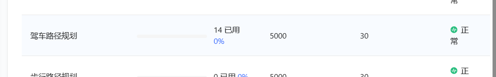
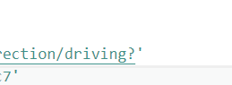
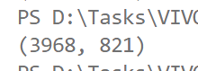
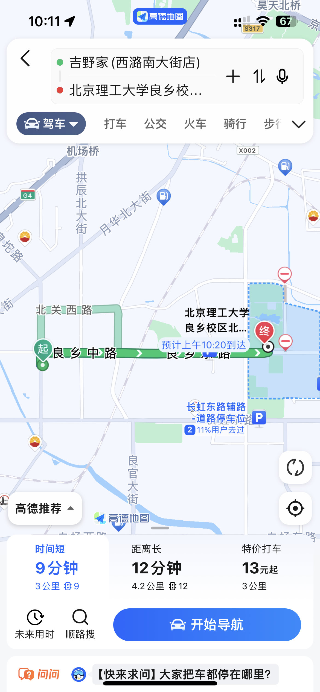
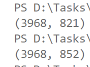
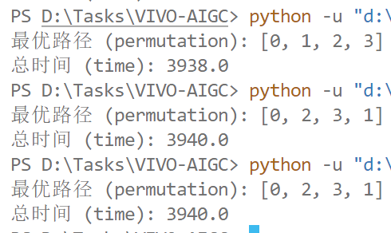

# 时间预估
## 高德地图API

可以通过调用高德地图API通过两个地点API获取路径数据

个人限制数量，驾车路径规划，一天5000次

功能1：可以选择**开车**/两轮车/**公共交通**（地铁/公交only）/步行

功能2：额外还能获取**距离**和**开销**（开车：油费&过路费）（公共交通：车费）

## 准确性评估

肯定准确的

### 不足之处

1. 由于输入的POI只有经纬度，不能像APP内准确预估进出那个门，只能大致估计
2. 反复运行同一个POI产生结果会有变化（*一致性***弱**，*时效性***强**）

## 配合TSP求解器的使用

正反圈有时时间接近

单位：秒