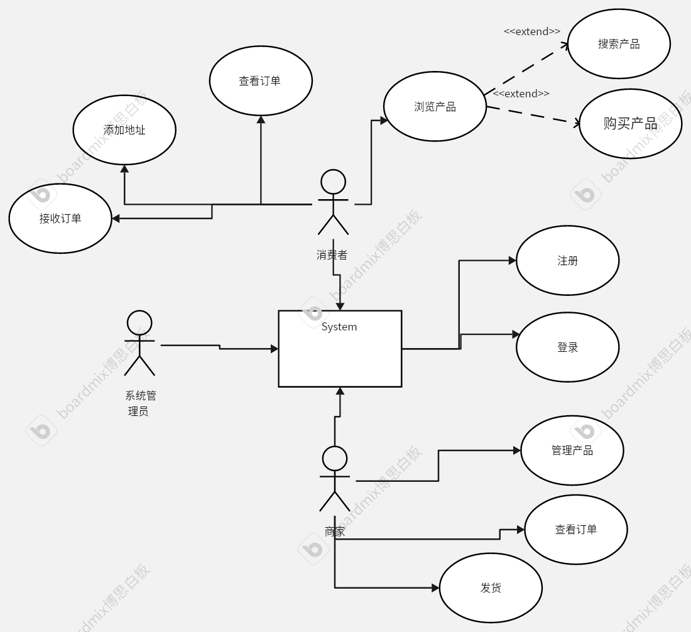
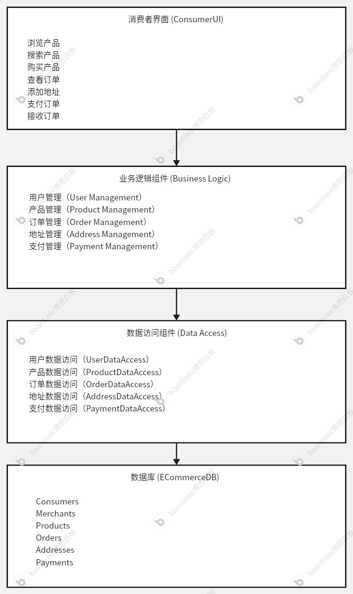
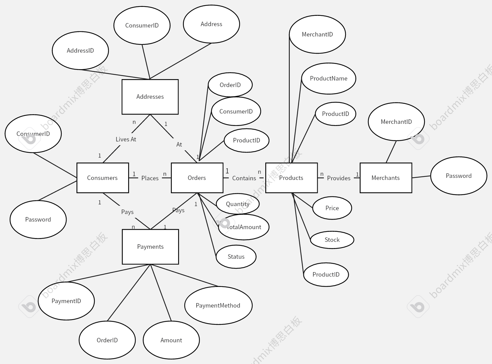
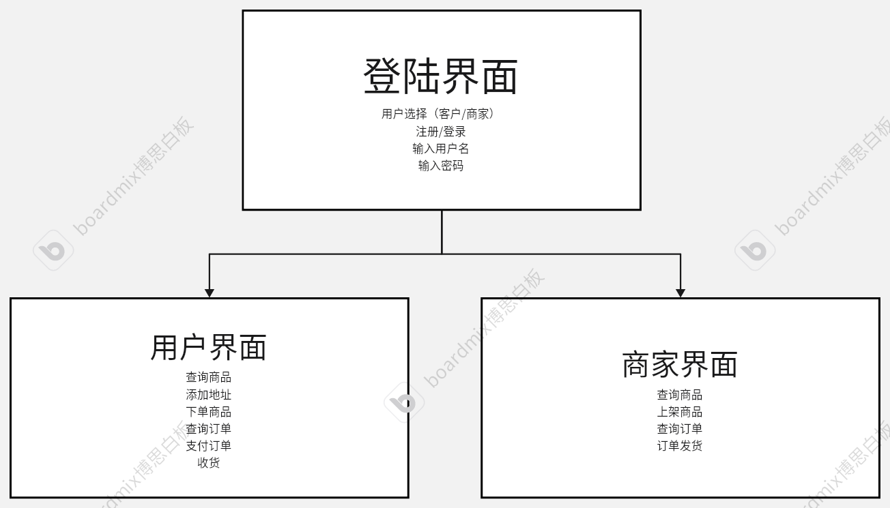
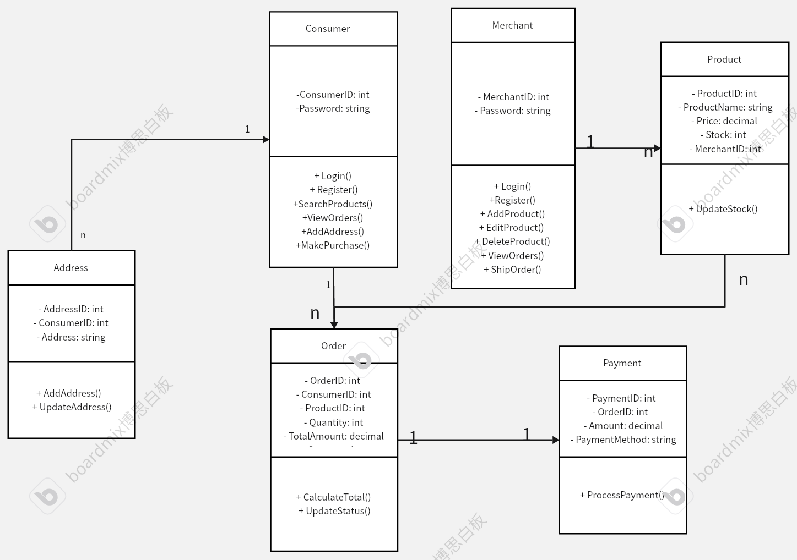
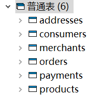
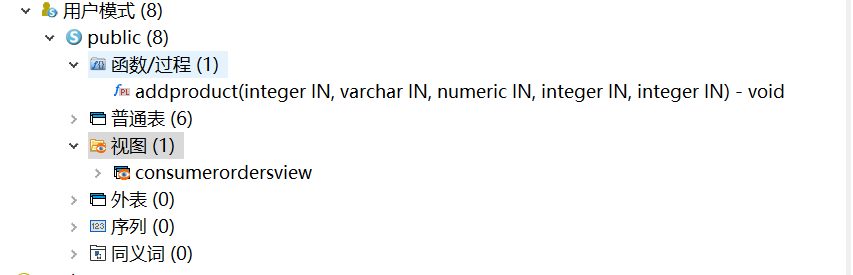
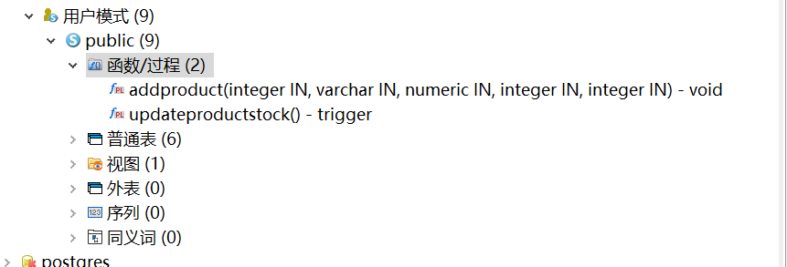
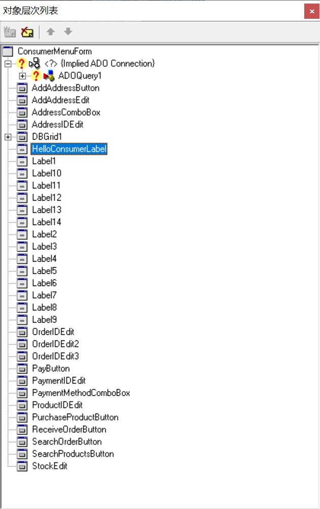
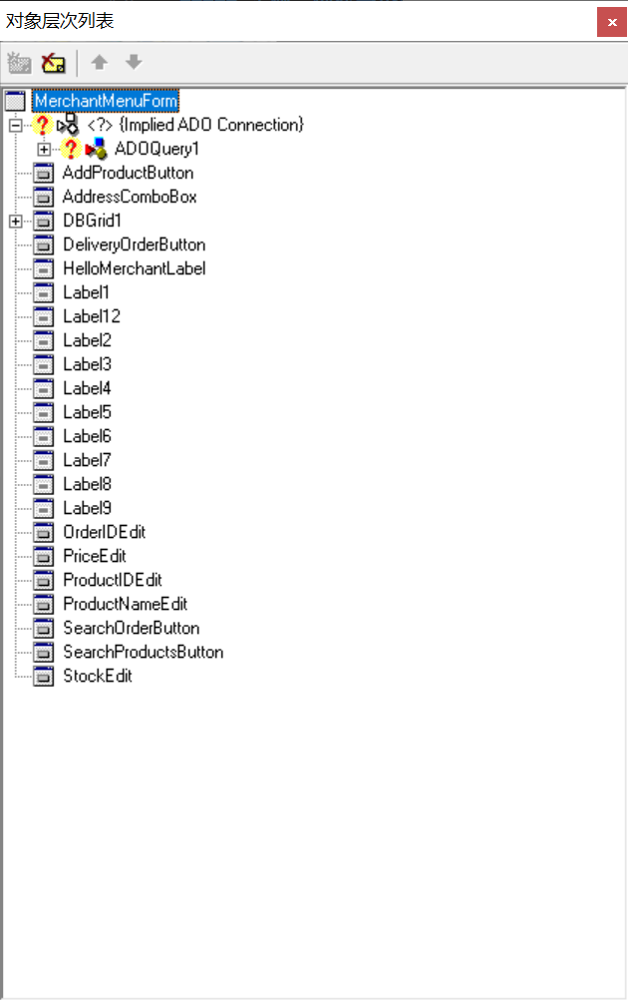

# 电子商务管理系统设计文档

# 目录

## 目录

- [电子商务管理系统设计文档](#电子商务管理系统设计文档)
- [目录](#目录)
  - [目录](#目录-1)
  - [1. 概述](#1-概述)
  - [2. 背景](#2-背景)
  - [3. 系统概述](#3-系统概述)
  - [4. 功能需求](#4-功能需求)
  - [5. 非功能需求](#5-非功能需求)
  - [6. 系统架构](#6-系统架构)
  - [7. 数据库设计](#7-数据库设计)
    - [数据表](#数据表)
      - [Consumers](#consumers)
      - [Merchants](#merchants)
      - [Products](#products)
      - [Orders](#orders)
      - [Addresses](#addresses)
      - [Payments](#payments)
  - [8. 界面设计](#8-界面设计)
  - [9. 详细设计](#9-详细设计)
  - [10. 测试计划](#10-测试计划)
  - [11. 维护计划](#11-维护计划)
  - [12. 数据库规范化](#12-数据库规范化)
    - [1. Consumers 表](#1-consumers-表)
    - [2. Merchants 表](#2-merchants-表)
    - [3. Products 表](#3-products-表)
    - [4. Orders 表](#4-orders-表)
    - [5. Addresses 表](#5-addresses-表)
    - [6. Payments 表](#6-payments-表)
    - [证明](#证明)
  - [13. 实现的评分项说明](#13-实现的评分项说明)
  - [该项目完成了全部的任务](#该项目完成了全部的任务)
    - [1. 使用Gauss数据库，至少六张表，含ER图，范式证明，提交数据库语句与数据库备份](#1-使用gauss数据库至少六张表含er图范式证明提交数据库语句与数据库备份)
      - [1. Consumers 表](#1-consumers-表-1)
      - [2. Merchants 表](#2-merchants-表-1)
      - [3. Products 表](#3-products-表-1)
      - [4. Orders 表](#4-orders-表-1)
      - [5. Addresses 表](#5-addresses-表-1)
      - [6. Payments 表](#6-payments-表-1)
      - [BCNF证明](#bcnf证明)
    - [2. 实现表的增删改查，提交了功能需求和设计说明，提交了使用说明书、源代码和可执行文件](#2-实现表的增删改查提交了功能需求和设计说明提交了使用说明书源代码和可执行文件)
    - [3. 有界面表级联操作](#3-有界面表级联操作)
      - [表级联操作证明](#表级联操作证明)
      - [1. 删除商家及其产品](#1-删除商家及其产品)
      - [2.删除消费者及其订单和地址](#2删除消费者及其订单和地址)
      - [3.删除订单及其付款记录](#3删除订单及其付款记录)
    - [4.有多个用户及链接](#4有多个用户及链接)
    - [5. 应用用户权限管理](#5-应用用户权限管理)
      - [消费者权限](#消费者权限)
      - [商家权限](#商家权限)
      - [实现权限检查的逻辑](#实现权限检查的逻辑)
    - [6. 视图和动态 SQL](#6-视图和动态-sql)
      - [视图](#视图)
      - [动态SQL](#动态sql)
      - [视图和动态 SQL 的结合](#视图和动态-sql-的结合)
    - [7.存储过程-函数-触发器](#7存储过程-函数-触发器)
      - [储存过程](#储存过程)
      - [触发器 (Trigger)](#触发器-trigger)
        - [示例：创建一个触发器在订单插入时自动更新产品库存](#示例创建一个触发器在订单插入时自动更新产品库存)
    - [8.待用delphi中至少五个组件](#8待用delphi中至少五个组件)

## 1. 概述

- **项目名称**：电子商务管理系统
- **文档版本**：1.0.0
- **创建日期**：2024/5/30
- **作者**：俞乐楠 1120221303
- **项目描述**：本项目旨在开发一个电子商务管理系统，支持消费者和商家在平台上进行商品购买和销售的操作。系统提供用户注册、登录、商品搜索、订单管理、支付处理、地址管理等功能，旨在提高交易效率，提升用户体验。

## 2. 背景

- **问题陈述**：当前市场上电子商务平台种类繁多，但很多中小型商家难以找到一个既能满足其需求，又具有良好用户体验的平台。同时，消费者在选择商品和购买过程中也存在各种不便。
- **目标**：开发一个高效、易用的电子商务管理系统，方便商家进行商品管理和销售，帮助消费者快速找到所需商品并完成交易。
- **受众**：中小型商家、普通消费者、平台管理员。

## 3. 系统概述

- **系统功能**：
  - 用户注册和登录
  - 消费者商品搜索和购买
  - 商家商品管理
  - 订单管理和状态跟踪
  - 支付处理
  - 地址管理
- **用户角色**：
  - **消费者**：浏览和购买商品，管理个人信息和地址，查看订单状态。
  - **商家**：管理商品信息，查看和处理订单。
  - **管理员**：管理用户信息，审核商家资格，维护系统正常运行。

## 4. 功能需求

- **需求列表**：
  - 用户注册、登录和注销
  - 消费者商品搜索、查看商品详情和购买商品
  - 商家添加、编辑和删除商品
  - 查看和管理订单状态
  - 支付订单并更新订单状态
  - 地址的添加、编辑和删除
- **用户故事**：
  - 作为消费者，我希望能搜索并购买商品，以便获得所需物品。
  - 作为商家，我希望能添加和管理商品，以便销售商品。
  - 作为管理员，我希望能管理用户和商家，以维护平台秩序。
- **用例图**：



## 5. 非功能需求

- **性能**：
  - 系统响应时间不超过2秒。
  - 支持每秒至少100次并发请求。
- **可用性**：
  - 界面设计简洁，用户操作便捷。
  - 提供详细的帮助文档和使用指南。
- **安全性**：
  - 所有用户数据加密存储。
  - 支持多因素认证。
- **可靠性**：
  - 系统可用性保证在99%以上。
  - 提供数据备份和恢复功能。
- **可维护性**：
  - 代码结构清晰，注释完善。

## 6. 系统架构

- **体系结构概述**：本系统采用三层架构，包括表现层、业务逻辑层和数据访问层。
- **组件图**：

- **技术栈**：
  - 前端：Delphi、ADO
  - 数据库：SQL Server

## 7. 数据库设计

- **ER图**：



- **数据字典**：
  - Consumers(ConsumerID, Password)
  - Merchants(MerchantID, Password)
  - Products(ProductID, ProductName, Price, Stock, MerchantID)
  - Orders(OrderID, ConsumerID, ProductID, Quantity, TotalAmount, Status)
  - Addresses(AddressID, ConsumerID, Address)
  - Payments(PaymentID, OrderID, Amount, PaymentMethod)

### 数据表

#### Consumers

- ConsumerID: INT PRIMARY KEY
- Password: VARCHAR(50) NOT NULL

#### Merchants

- MerchantID: INT PRIMARY KEY
- Password: VARCHAR(50) NOT NULL

#### Products

- ProductID: INT PRIMARY KEY
- ProductName: VARCHAR(100) NOT NULL
- Price: DECIMAL(10, 2) NOT NULL
- Stock: INT NOT NULL
- MerchantID: INT NOT NULL (FOREIGN KEY REFERENCES Merchants(MerchantID))

#### Orders

- OrderID: INT PRIMARY KEY
- ConsumerID: INT NOT NULL (FOREIGN KEY REFERENCES Consumers(ConsumerID))
- ProductID: INT NOT NULL (FOREIGN KEY REFERENCES Products(ProductID))
- Quantity: INT NOT NULL
- TotalAmount: DECIMAL(10, 2) NOT NULL
- Status: VARCHAR(20) NOT NULL

#### Addresses

- AddressID: INT PRIMARY KEY
- ConsumerID: INT NOT NULL (FOREIGN KEY REFERENCES Consumers(ConsumerID))
- Address: VARCHAR(255) NOT NULL

#### Payments

- PaymentID: INT PRIMARY KEY
- OrderID: INT NOT NULL (FOREIGN KEY REFERENCES Orders(OrderID))
- Amount: DECIMAL(10, 2) NOT NULL
- PaymentMethod: VARCHAR(50) NOT NULL

## 8. 界面设计

- **界面流程**：见附件F



## 9. 详细设计

- **类图**：

- **顺序图**：见附件H
- **状态图**：见附件I

## 10. 测试计划

- **测试用例**：


- **测试环境**：Windows 10, OpenEuler, OpenGauss, Data Studio, Delphi 7.0 IDE
- **测试策略**：单元测试、集成测试、系统测试、用户验收测试

## 11. 维护计划

- **维护策略**：定期更新、错误修复、功能扩展

## 12. 数据库规范化

以下是对数据库表进行第三范式（3NF）和BCNF（Boyce-Codd范式）规范化的证明。

### 1. Consumers 表

```sql
CREATE TABLE Consumers (
    ConsumerID INT PRIMARY KEY,
    Password VARCHAR(50) NOT NULL
);
```

- **第一范式 (1NF)**: 所有列的值都是原子的，没有重复的列。
- **第二范式 (2NF)**: 只有一个候选键，即 `ConsumerID`，所以不存在部分依赖。
- **第三范式 (3NF)**: `Password` 仅依赖于 `ConsumerID`（主键），没有传递依赖。

### 2. Merchants 表

```sql
CREATE TABLE Merchants (
    MerchantID INT PRIMARY KEY,
    Password VARCHAR(50) NOT NULL
);

```

- **第一范式 (1NF)**: 所有列的值都是原子的，没有重复的列。
- **第二范式 (2NF)**: 只有一个候选键，即 `MerchantID`，所以不存在部分依赖。
- **第三范式 (3NF)**: `Password` 仅依赖于 `MerchantID`（主键），没有传递依赖。

### 3. Products 表

```sql
CREATE TABLE Products (
    ProductID INT PRIMARY KEY,
    ProductName VARCHAR(100) NOT NULL,
    Price DECIMAL(10, 2) NOT NULL,
    Stock INT NOT NULL,
    MerchantID INT NOT NULL,
    FOREIGN KEY (MerchantID) REFERENCES Merchants(MerchantID) ON DELETE CASCADE
);

```

- **第一范式 (1NF)**: 所有列的值都是原子的，没有重复的列。
- **第二范式 (2NF)**: `ProductID` 是主键，所有非主键列 (`ProductName`, `Price`, `Stock`, `MerchantID`) 完全依赖于主键。
- **第三范式 (3NF)**: 所有非主键列直接依赖于主键，没有传递依赖。

### 4. Orders 表

```sql
CREATE TABLE Orders (
    OrderID INT PRIMARY KEY,
    ConsumerID INT NOT NULL,
    ProductID INT NOT NULL,
    Quantity INT NOT NULL,
    TotalAmount DECIMAL(10, 2) NOT NULL,
    Status VARCHAR(20) NOT NULL,
    FOREIGN KEY (ConsumerID) REFERENCES Consumers(ConsumerID) ON DELETE CASCADE,
    FOREIGN KEY (ProductID) REFERENCES Products(ProductID) ON DELETE CASCADE
);

```

- **第一范式 (1NF)**: 所有列的值都是原子的，没有重复的列。
- **第二范式 (2NF)**: `OrderID` 是主键，所有非主键列 (`ConsumerID`, `ProductID`, `Quantity`, `TotalAmount`, `Status`) 完全依赖于主键。
- **第三范式 (3NF)**: 所有非主键列直接依赖于主键，没有传递依赖。

### 5. Addresses 表

```sql
CREATE TABLE Addresses (
    AddressID INT PRIMARY KEY,
    ConsumerID INT NOT NULL,
    Address VARCHAR(255) NOT NULL,
    FOREIGN KEY (ConsumerID) REFERENCES Consumers(ConsumerID) ON DELETE CASCADE
);
```

- **第一范式 (1NF)**: 所有列的值都是原子的，没有重复的列。
- **第二范式 (2NF)**: `AddressID` 是主键，所有非主键列 (`ConsumerID`, `Address`) 完全依赖于主键。
- **第三范式 (3NF)**: 所有非主键列直接依赖于主键，没有传递依赖。

### 6. Payments 表

```sql
CREATE TABLE Payments (
    PaymentID INT PRIMARY KEY,
    OrderID INT NOT NULL,
    Amount DECIMAL(10, 2) NOT NULL,
    PaymentMethod VARCHAR(50) NOT NULL,
    FOREIGN KEY (OrderID) REFERENCES Orders(OrderID) ON DELETE CASCADE
);
```

- **第一范式 (1NF)**: 所有列的值都是原子的，没有重复的列。
- **第二范式 (2NF)**: `PaymentID` 是主键，所有非主键列 (`OrderID`, `Amount`, `PaymentMethod`) 完全依赖于主键。
- **第三范式 (3NF)**: 所有非主键列直接依赖于主键，没有传递依赖。

### 证明

所有表都符合以下条件：

- 每个表中的所有属性都是原子的，没有重复的列，符合第一范式 (1NF)。
- 每个表的非主键属性完全依赖于主键，符合第二范式 (2NF)。
- 每个表的非主键属性没有传递依赖，直接依赖于主键，符合第三范式 (3NF)。

此外，由于所有表的候选键都只有一个，因此这些表也符合BCNF（Boyce-Codd范式）。

## 13. 实现的评分项说明

## 该项目完成了全部的任务

### 1. 使用Gauss数据库，至少六张表，含ER图，范式证明，提交数据库语句与数据库备份

使用了至少六张表



ER图


范式证明在[Design documents.pdf](<Design documents.pdf>)中

以下是对数据库表进行第三范式（3NF）和BCNF（Boyce-Codd范式）规范化的证明。

#### 1. Consumers 表

```sql
CREATE TABLE Consumers (
    ConsumerID INT PRIMARY KEY,
    Password VARCHAR(50) NOT NULL
);
```

- **第一范式 (1NF)**: 所有列的值都是原子的，没有重复的列。
- **第二范式 (2NF)**: 只有一个候选键，即 `ConsumerID`，所以不存在部分依赖。
- **第三范式 (3NF)**: `Password` 仅依赖于 `ConsumerID`（主键），没有传递依赖。

#### 2. Merchants 表

```sql
CREATE TABLE Merchants (
    MerchantID INT PRIMARY KEY,
    Password VARCHAR(50) NOT NULL
);

```

- **第一范式 (1NF)**: 所有列的值都是原子的，没有重复的列。
- **第二范式 (2NF)**: 只有一个候选键，即 `MerchantID`，所以不存在部分依赖。
- **第三范式 (3NF)**: `Password` 仅依赖于 `MerchantID`（主键），没有传递依赖。

#### 3. Products 表

```sql
CREATE TABLE Products (
    ProductID INT PRIMARY KEY,
    ProductName VARCHAR(100) NOT NULL,
    Price DECIMAL(10, 2) NOT NULL,
    Stock INT NOT NULL,
    MerchantID INT NOT NULL,
    FOREIGN KEY (MerchantID) REFERENCES Merchants(MerchantID) ON DELETE CASCADE
);

```

- **第一范式 (1NF)**: 所有列的值都是原子的，没有重复的列。
- **第二范式 (2NF)**: `ProductID` 是主键，所有非主键列 (`ProductName`, `Price`, `Stock`, `MerchantID`) 完全依赖于主键。
- **第三范式 (3NF)**: 所有非主键列直接依赖于主键，没有传递依赖。

#### 4. Orders 表

```sql
CREATE TABLE Orders (
    OrderID INT PRIMARY KEY,
    ConsumerID INT NOT NULL,
    ProductID INT NOT NULL,
    Quantity INT NOT NULL,
    TotalAmount DECIMAL(10, 2) NOT NULL,
    Status VARCHAR(20) NOT NULL,
    FOREIGN KEY (ConsumerID) REFERENCES Consumers(ConsumerID) ON DELETE CASCADE,
    FOREIGN KEY (ProductID) REFERENCES Products(ProductID) ON DELETE CASCADE
);

```

- **第一范式 (1NF)**: 所有列的值都是原子的，没有重复的列。
- **第二范式 (2NF)**: `OrderID` 是主键，所有非主键列 (`ConsumerID`, `ProductID`, `Quantity`, `TotalAmount`, `Status`) 完全依赖于主键。
- **第三范式 (3NF)**: 所有非主键列直接依赖于主键，没有传递依赖。

#### 5. Addresses 表

```sql
CREATE TABLE Addresses (
    AddressID INT PRIMARY KEY,
    ConsumerID INT NOT NULL,
    Address VARCHAR(255) NOT NULL,
    FOREIGN KEY (ConsumerID) REFERENCES Consumers(ConsumerID) ON DELETE CASCADE
);
```

- **第一范式 (1NF)**: 所有列的值都是原子的，没有重复的列。
- **第二范式 (2NF)**: `AddressID` 是主键，所有非主键列 (`ConsumerID`, `Address`) 完全依赖于主键。
- **第三范式 (3NF)**: 所有非主键列直接依赖于主键，没有传递依赖。

#### 6. Payments 表

```sql
CREATE TABLE Payments (
    PaymentID INT PRIMARY KEY,
    OrderID INT NOT NULL,
    Amount DECIMAL(10, 2) NOT NULL,
    PaymentMethod VARCHAR(50) NOT NULL,
    FOREIGN KEY (OrderID) REFERENCES Orders(OrderID) ON DELETE CASCADE
);
```

- **第一范式 (1NF)**: 所有列的值都是原子的，没有重复的列。
- **第二范式 (2NF)**: `PaymentID` 是主键，所有非主键列 (`OrderID`, `Amount`, `PaymentMethod`) 完全依赖于主键。
- **第三范式 (3NF)**: 所有非主键列直接依赖于主键，没有传递依赖。

#### BCNF证明

所有表都符合以下条件：

- 每个表中的所有属性都是原子的，没有重复的列，符合第一范式 (1NF)。
- 每个表的非主键属性完全依赖于主键，符合第二范式 (2NF)。
- 每个表的非主键属性没有传递依赖，直接依赖于主键，符合第三范式 (3NF)。

此外，由于所有表的候选键都只有一个，因此这些表也符合BCNF（Boyce-Codd范式）。

### 2. 实现表的增删改查，提交了功能需求和设计说明，提交了使用说明书、源代码和可执行文件

[功能需求与设计说明Design documents.pdf](<Design documents.pdf>)
[使用说明书UserManual.pdf](UserManual.pdf)
[源代码](源代码)
[可执行文件](可执行文件)

### 3. 有界面表级联操作

#### 表级联操作证明

为了证明数据库表具有级联操作，我们展示了以下场景：

#### 1. 删除商家及其产品

当删除 `Merchants` 表中的记录时，相关的 `Products` 表中的记录也会被删除。

```sql
-- 插入示例数据
INSERT INTO Merchants (MerchantID, Password) VALUES (1, 'merchantpass');
INSERT INTO Products (ProductID, ProductName, Price, Stock, MerchantID) VALUES (1, 'Product A', 100.00, 10, 1);

-- 删除商家记录
DELETE FROM Merchants WHERE MerchantID = 1;

-- 级联删除后的结果
SELECT * FROM Products; -- 结果为空，因为相关的产品记录已被删除
```

#### 2.删除消费者及其订单和地址

当删除 Consumers 表中的记录时，相关的 Orders 和 Addresses 表中的记录也会被删除。

```sql
-- 插入示例数据
INSERT INTO Consumers (ConsumerID, Password) VALUES (1, 'consumerpass');
INSERT INTO Orders (OrderID, ConsumerID, ProductID, Quantity, TotalAmount, Status) VALUES (1, 1, 1, 1, 100.00, 'Pending');
INSERT INTO Addresses (AddressID, ConsumerID, Address) VALUES (1, 1, '123 Main St');

-- 删除消费者记录
DELETE FROM Consumers WHERE ConsumerID = 1;

-- 级联删除后的结果
SELECT * FROM Orders;   -- 结果为空，因为相关的订单记录已被删除
SELECT * FROM Addresses; -- 结果为空，因为相关的地址记录已被删除

```

#### 3.删除订单及其付款记录

当删除 Orders 表中的记录时，相关的 Payments 表中的记录也会被删除。

```sql
-- 插入示例数据
INSERT INTO Orders (OrderID, ConsumerID, ProductID, Quantity, TotalAmount, Status) VALUES (1, 1, 1, 1, 100.00, 'Pending');
INSERT INTO Payments (PaymentID, OrderID, Amount, PaymentMethod) VALUES (1, 1, 100.00, 'Credit Card');

-- 删除订单记录
DELETE FROM Orders WHERE OrderID = 1;

-- 级联删除后的结果
SELECT * FROM Payments; -- 结果为空，因为相关的付款记录已被删除


```

通过这些操作，证明了数据库表具有级联操作（表级联）的能力。当父表的记录被删除时，相关的子表记录会自动被删除，保持数据的一致性和完整性。

### 4.有多个用户及链接


### 5. 应用用户权限管理

为了实现应用的用户权限管理，我们设计了以下两个角色：

- 消费者 (Consumer)
- 商家 (Merchant)

每个角色有不同的权限和功能：

#### 消费者权限

1. 查看产品
2. 添加地址
3. 购买产品
4. 查看订单
5. 支付订单
6. 接收订单

#### 商家权限

1. 查看自己的产品
2. 添加产品
3. 查看订单
4. 发货订单

通过以下SQL示例，我们展示了如何为不同角色的用户分配权限：

```sql
-- 示例用户表结构
CREATE TABLE Users (
    UserID INT PRIMARY KEY,
    Username VARCHAR(50) NOT NULL,
    Password VARCHAR(50) NOT NULL,
    Role VARCHAR(10) NOT NULL -- 角色：'Consumer' 或 'Merchant'
);

-- 插入示例用户
INSERT INTO Users (UserID, Username, Password, Role) VALUES (1, 'consumer1', 'password1', 'Consumer');
INSERT INTO Users (UserID, Username, Password, Role) VALUES (2, 'merchant1', 'password1', 'Merchant');

-- 根据角色分配权限的存储过程
CREATE PROCEDURE AssignRolePermissions()
BEGIN
    -- 为消费者分配权限
    INSERT INTO ConsumerPermissions (ConsumerID)
    SELECT UserID FROM Users WHERE Role = 'Consumer';

    -- 为商家分配权限
    INSERT INTO MerchantPermissions (MerchantID)
    SELECT UserID FROM Users WHERE Role = 'Merchant';
END;

-- 调用存储过程
CALL AssignRolePermissions();
```

#### 实现权限检查的逻辑

在应用程序中，可以通过检查用户的角色来决定是否授予特定操作的权限。例如：

```pascal
procedure TConsumerMenuForm.CheckUserPermissions(UserID: Integer);
var
  UserRole: string;
begin
  // 查询用户角色
  ADOQuery1.Close;
  ADOQuery1.SQL.Text := Format('SELECT Role FROM Users WHERE UserID = %d', [UserID]);
  ADOQuery1.Open;

  if not ADOQuery1.IsEmpty then
  begin
    UserRole := ADOQuery1.FieldByName('Role').AsString;

    if UserRole = 'Consumer' then
    begin
      // 显示消费者菜单
      ConsumerMenuForm.Show;
    end
    else if UserRole = 'Merchant' then
    begin
      // 显示商家菜单
      MerchantMenuForm.Show;
    end
    else
    begin
      ShowMessage('Unknown role.');
    end;
  end
  else
  begin
    ShowMessage('User not found.');
  end;
end;
```

通过这种方式，我们确保了不同角色的用户只能访问和操作其权限范围内的功能，从而实现了应用用户权限管理。

### 6. 视图和动态 SQL

#### 视图

为了简化查询并提高安全性，我们可以使用视图。视图可以将复杂的查询封装起来，用户可以像访问表一样访问视图，从而实现数据的抽象和隐藏。以下是两个视图的示例，一个用于消费者查看产品信息，另一个用于商家查看订单信息。

```sql
-- 消费者查看产品信息视图
-- 如果视图已经存在，则删除它
DROP VIEW IF EXISTS ConsumerOrdersView;

-- 创建消费者查看订单的视图
CREATE VIEW ConsumerOrdersView AS
SELECT
    o.OrderID,
    o.ConsumerID,
    c.Password AS ConsumerPassword,
    o.ProductID,
    p.ProductName,
    o.Quantity,
    o.TotalAmount,
    o.Status,
    p.MerchantID,
    m.Password AS MerchantPassword
FROM
    Orders o
JOIN
    Consumers c ON o.ConsumerID = c.ConsumerID
JOIN
    Products p ON o.ProductID = p.ProductID
JOIN
    Merchants m ON p.MerchantID = m.MerchantID;

-- 查询视图以验证其内容
SELECT * FROM ConsumerOrdersView;

```

#### 动态SQL

动态 SQL 是指在程序运行时生成和执行的 SQL 语句，适用于需要根据不同条件生成不同 SQL 查询的场景。以下示例展示了如何使用动态 SQL 查询产品信息。

```pascal
    // 检查ID是否已存在
    if UserType = 'Consumer' then
      Query.SQL.Text := Format('SELECT COUNT(*) AS UserCount FROM Consumers WHERE ConsumerID = %s', [QuotedStr(UserID)])
    else if UserType = 'Merchant' then
      Query.SQL.Text := Format('SELECT COUNT(*) AS UserCount FROM Merchants WHERE MerchantID = %s', [QuotedStr(UserID)]);
    Query.Open;
```

例如上文中我的代码就使用了动态sql。通过这种方式，可以根据用户的不同需求灵活地查询数据。

#### 视图和动态 SQL 的结合

结合视图和动态 SQL，可以进一步提高查询的灵活性和安全性。例如，可以在视图的基础上使用动态 SQL 来查询特定条件的数据。通过这种方式，可以充分利用视图和动态 SQL 的优势，实现灵活、高效、安全的数据查询。

### 7.存储过程-函数-触发器

#### 储存过程

下面的语句中使用了储存过程

```sql
-- 如果存储过程 AddProduct 已存在，则将其删除
DROP PROCEDURE IF EXISTS AddProduct;

-- 创建新的存储过程 AddProduct
CREATE OR REPLACE PROCEDURE AddProduct(
    IN p_ProductID INT,
    IN p_ProductName VARCHAR(100),
    IN p_Price DECIMAL(10, 2),
    IN p_Stock INT,
    IN p_MerchantID INT
)
AS
BEGIN
    -- 插入新产品到 Products 表中
    INSERT INTO Products (ProductID, ProductName, Price, Stock, MerchantID)
    VALUES (p_ProductID, p_ProductName, p_Price, p_Stock, p_MerchantID);
    
    -- 输出一条消息，指示插入成功
    RAISE NOTICE 'Product % has been added successfully.', p_ProductName;
END;

```

可以看出我创建了储存过程



#### 触发器 (Trigger)

执行这些SQL命令后，每当向 Orders 表插入新记录时，Products 表中的库存将自动减少相应数量。

##### 示例：创建一个触发器在订单插入时自动更新产品库存

```sql

-- 删除已有的触发器函数
DROP FUNCTION IF EXISTS UpdateProductStock;

-- 创建新的触发器函数
CREATE OR REPLACE FUNCTION UpdateProductStock()
RETURNS TRIGGER
AS $$
BEGIN
    -- 减少产品库存
    UPDATE Products
    SET Stock = Stock - NEW.Quantity
    WHERE ProductID = NEW.ProductID;
    
    RETURN NEW;
END;
$$ LANGUAGE plpgsql;

```

可以看到我成功创建使用了触发器



不过也可以在delphi中手动更改。

### 8.待用delphi中至少五个组件

我主要使用了以下组件

- TADOConnection：用于与数据库建立连接。
- TADOQuery：用于执行SQL查询语句，并获取查询结果。
- TDataSource：数据源组件，用于提供数据给数据控件。
- TDBGrid：数据表格组件，用于显示数据库查询结果。
- TDBNavigator：数据导航栏组件，用于浏览数据记录。
- TEdit：文本框组件，用于输入文本信息。
- TLabel：标签组件，用于显示静态文本信息。
- TButton：按钮组件，用于触发事件。
- TComboBox：下拉框组件，用于选择项。

通过对象层次列表，可以看到我用了十余种组件



