# 产品使用说明书

## 目录

- [产品使用说明书](#产品使用说明书)
  - [目录](#目录)
  - [简介](#简介)
  - [系统要求](#系统要求)
  - [启动和登录](#启动和登录)
  - [主要功能](#主要功能)
    - [注册用户](#注册用户)
      - [详细步骤](#详细步骤)
      - [用户注册界面的功能与详细描述](#用户注册界面的功能与详细描述)
        - [1. 在登录界面选择“Register”按钮](#1-在登录界面选择register按钮)
        - [2. 选择用户类型（Consumer 或 Merchant）](#2-选择用户类型consumer-或-merchant)
        - [3. 输入用户 ID 和密码进行注册](#3-输入用户-id-和密码进行注册)
        - [4. 处理注册错误的反馈](#4-处理注册错误的反馈)
      - [注册流程的用户体验](#注册流程的用户体验)
      - [示例注册流程图](#示例注册流程图)
      - [注册功能总结](#注册功能总结)
    - [用户登录功能介绍](#用户登录功能介绍)
      - [登录详细步骤](#登录详细步骤)
      - [用户登录界面的功能与详细描述](#用户登录界面的功能与详细描述)
        - [1. 在登录界面选择用户类型](#1-在登录界面选择用户类型)
        - [2. 输入用户 ID 和密码进行登录](#2-输入用户-id-和密码进行登录)
        - [3. 点击“登录”按钮](#3-点击登录按钮)
        - [4. 登录成功后进入对应的用户界面](#4-登录成功后进入对应的用户界面)
      - [错误反馈示例](#错误反馈示例)
        - [1.用户类型选择错误](#1用户类型选择错误)
        - [2.用户或者密码错误](#2用户或者密码错误)
        - [3.有项目空着](#3有项目空着)
      - [示例登录流程图](#示例登录流程图)
      - [用户登录功能总结](#用户登录功能总结)
    - [消费者功能](#消费者功能)
      - [欢迎用户](#欢迎用户)
      - [查看产品](#查看产品)
      - [添加地址](#添加地址)
        - [添加地址详细步骤](#添加地址详细步骤)
        - [添加地址界面的功能与详细描述](#添加地址界面的功能与详细描述)
          - [1. 输入地址 ID 和详细地址](#1-输入地址-id-和详细地址)
          - [2. 点击“添加地址”按钮](#2-点击添加地址按钮)
        - [添加地址合法性检测](#添加地址合法性检测)
        - [示例添加地址流程图](#示例添加地址流程图)
        - [添加地址功能总结](#添加地址功能总结)
      - [购买产品](#购买产品)
        - [购买产品详细步骤](#购买产品详细步骤)
        - [购买产品界面的功能与详细描述](#购买产品界面的功能与详细描述)
          - [1. 输入订单 ID、产品 ID 和购买数量](#1-输入订单-id产品-id-和购买数量)
          - [2. 点击“购买产品”按钮](#2-点击购买产品按钮)
        - [合法性检测](#合法性检测)
        - [示例购买产品流程图](#示例购买产品流程图)
        - [购买产品功能总结](#购买产品功能总结)
      - [查询订单](#查询订单)
        - [查询订单详细步骤](#查询订单详细步骤)
        - [查询订单界面的功能与详细描述](#查询订单界面的功能与详细描述)
          - [1. 点击“查询订单”按钮](#1-点击查询订单按钮)
          - [2. 查看用户的所有订单](#2-查看用户的所有订单)
        - [示例查询订单流程图](#示例查询订单流程图)
        - [查询订单功能总结](#查询订单功能总结)
      - [支付订单](#支付订单)
        - [支付订单详细步骤](#支付订单详细步骤)
        - [支付订单界面的功能与详细描述](#支付订单界面的功能与详细描述)
          - [1. 输入支付 ID、订单 ID 和支付方式](#1-输入支付-id订单-id-和支付方式)
          - [2. 点击“支付”按钮](#2-点击支付按钮)
          - [3. 完成支付并更新订单状态](#3-完成支付并更新订单状态)
        - [非法输入处理](#非法输入处理)
        - [示例支付订单流程图](#示例支付订单流程图)
        - [支付订单功能总结](#支付订单功能总结)
      - [确认收货](#确认收货)
        - [确认收货详细步骤](#确认收货详细步骤)
        - [确认收货界面的功能与详细描述](#确认收货界面的功能与详细描述)
          - [1. 输入订单 ID](#1-输入订单-id)
          - [2. 点击“确认收货”按钮](#2-点击确认收货按钮)
        - [订单ID非法输入处理](#订单id非法输入处理)
        - [示例确认收货流程图](#示例确认收货流程图)
        - [确认收货功能总结](#确认收货功能总结)
    - [商家功能](#商家功能)
      - [查看商品](#查看商品)
        - [查看商品详细步骤](#查看商品详细步骤)
        - [查看商品界面的功能与详细描述](#查看商品界面的功能与详细描述)
          - [1. 登录成功后，点击“查看产品”按钮](#1-登录成功后点击查看产品按钮)
          - [2. 查询并显示商家相关的产品](#2-查询并显示商家相关的产品)
        - [示例查看商品流程图](#示例查看商品流程图)
        - [查看商品功能总结](#查看商品功能总结)
      - [添加产品](#添加产品)
        - [添加产品详细步骤](#添加产品详细步骤)
        - [添加产品界面的功能与详细描述](#添加产品界面的功能与详细描述)
          - [1. 输入产品 ID、产品名称、价格和库存](#1-输入产品-id产品名称价格和库存)
          - [2. 点击“添加产品”按钮](#2-点击添加产品按钮)
        - [添加产品合法性检测](#添加产品合法性检测)
        - [示例添加产品流程图](#示例添加产品流程图)
        - [添加产品功能总结](#添加产品功能总结)
      - [查询商单](#查询商单)
        - [查询商单详细步骤](#查询商单详细步骤)
        - [查询商单界面的功能与详细描述](#查询商单界面的功能与详细描述)
          - [1. 点击查询订单按钮](#1-点击查询订单按钮-1)
          - [2. 查询并显示商家所有订单](#2-查询并显示商家所有订单)
        - [示例查询商单流程图](#示例查询商单流程图)
        - [查询商单功能总结](#查询商单功能总结)
      - [订单发货](#订单发货)
        - [订单发货详细步骤](#订单发货详细步骤)
        - [订单发货界面的功能与详细描述](#订单发货界面的功能与详细描述)
          - [1. 输入订单ID](#1-输入订单id)
          - [2. 点击“发货”按钮](#2-点击发货按钮)
          - [3. 更新订单状态为“已发货”](#3-更新订单状态为已发货)
        - [订单发货合法性检测](#订单发货合法性检测)
        - [示例订单发货流程图](#示例订单发货流程图)
        - [订单发货功能总结](#订单发货功能总结)
  - [故障排除](#故障排除)
    - [1. **登录问题**](#1-登录问题)
    - [2. **注册问题**](#2-注册问题)
    - [3. **购买产品问题**](#3-购买产品问题)
    - [4. **查询订单问题**](#4-查询订单问题)
    - [5. **地址管理问题**](#5-地址管理问题)
    - [6. **支付订单问题**](#6-支付订单问题)
    - [7. **确认收货问题**](#7-确认收货问题)
    - [8. **添加产品问题**](#8-添加产品问题)
    - [9. **查询商单问题**](#9-查询商单问题)
    - [10. **订单发货问题**](#10-订单发货问题)
  - [常见问题](#常见问题)
    - [1. **登录问题**](#1-登录问题-1)
    - [2. **注册问题**](#2-注册问题-1)
    - [3. **购买产品问题**](#3-购买产品问题-1)
    - [4. **查询订单问题**](#4-查询订单问题-1)
    - [5. **地址管理问题**](#5-地址管理问题-1)
    - [6. **支付订单问题**](#6-支付订单问题-1)
    - [7. **确认收货问题**](#7-确认收货问题-1)
    - [8. **添加产品问题**](#8-添加产品问题-1)
    - [9. **查询商单问题**](#9-查询商单问题-1)
    - [10. **订单发货问题**](#10-订单发货问题-1)
  - [联系支持](#联系支持)

## 简介

本软件是一款为消费者和商家提供交易平台的综合解决方案。用户可以通过该平台进行注册、登录，并访问不同的功能模块。消费者可以查看和购买产品，管理订单并确认收货。商家可以添加和管理产品，处理订单发货等操作。平台的主要功能包括：

- **注册和登录**：用户可以注册成为消费者或商家，并通过登录访问相应的功能模块。
- **产品查看**：消费者可以浏览商家提供的各类产品，并选择购买。
- **订单管理**：消费者可以查看和管理自己的订单状态，商家可以查看所有订单并进行发货操作。
- **支付功能**：消费者可以通过平台完成订单支付，支付成功后订单状态将更新为“待发货”。
- **地址管理**：消费者可以添加和管理自己的收货地址，确保订单的准确送达。

本软件通过简洁直观的用户界面和完善的功能设计，致力于提升消费者和商家的交易体验，促进双方的高效互动和交易。

## 系统要求

为了保证本软件的正常运行和最佳性能，请确保您的系统满足以下要求：

- **操作系统**：Windows XP 或更高版本
- **内存**：至少 2 GB
- **硬盘空间**：至少 200 MB
- **其他软件**：需要安装 ADO 数据库组件

确保您的系统符合上述要求，可以有效提升软件的运行效率和用户体验。

## 启动和登录

1. **启动软件**：双击软件图标或通过开始菜单启动程序。
2. **选择用户类型**：在登录界面选择用户类型（消费者或商家）。
3. **输入用户 ID 和密码进行登录**：在相应的输入框中输入您的用户 ID 和密码，然后点击“登录”按钮。
4. **初次使用请先注册账号**：如果您是第一次使用本软件，请先点击“注册”按钮，选择用户类型并填写注册信息完成账号注册。

## 主要功能

### 注册用户

在你的应用程序中，用户可以通过注册界面创建新的用户账户。注册过程包括选择用户类型（Consumer 或 Merchant）、输入用户 ID 和密码，并处理各种可能的错误反馈。

#### 详细步骤

1. **在登录界面选择“Register”按钮**
2. **选择用户类型（Consumer 或 Merchant）**
3. **输入用户 ID 和密码进行注册**
4. **处理注册错误的反馈**

#### 用户注册界面的功能与详细描述

##### 1. 在登录界面选择“Register”按钮

- 用户在登录界面点击“Register”按钮来开始注册流程。

##### 2. 选择用户类型（Consumer 或 Merchant）

- 在注册表单中，用户可以选择他们的用户类型。
- 用户类型选择框通常是一个下拉菜单，用户可以选择“Consumer”或“Merchant”。

##### 3. 输入用户 ID 和密码进行注册

- 用户需要在注册表单中输入他们的用户 ID 和密码。
- 用户 ID 和密码需要满足一定的格式和要求，例如：
  - 用户 ID 不能为空，并且应该是唯一的。
  - 密码不能为空，并且应该满足一定的复杂度要求，例如包含大小写字母、数字和特殊字符。

##### 4. 处理注册错误的反馈

- 如果用户输入无效，系统会显示相应的错误信息，并提示用户修改输入。常见的错误反馈包括：
  - 用户 ID 或密码为空：显示“UserID 和密码不能为空。”
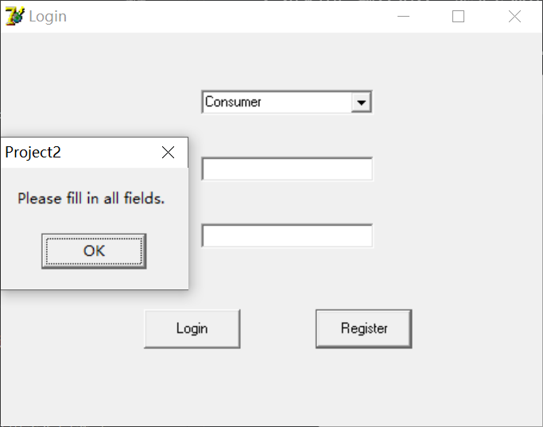
  - 用户 ID 已存在：显示“该 UserID 已被注册，请选择其他 UserID。”
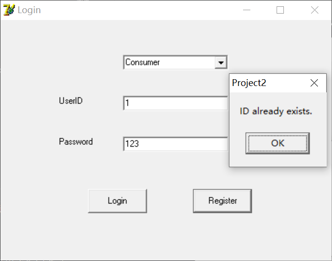

#### 注册流程的用户体验

- **注册成功**：当用户成功注册后，系统会显示“注册成功”消息，并引导用户返回登录界面或直接登录。

- **注册失败**：当用户注册失败时，系统会显示具体的错误信息，提示用户需要修改的内容。

#### 示例注册流程图

1. **注册界面**
    - 用户选择用户类型（Consumer 或 Merchant）
    - 用户输入用户 ID 和密码
    - 用户点击“Register”按钮
2. **验证输入**
    - 系统检查用户输入的合法性
    - 如果输入无效，显示错误信息
    - 如果输入有效，将用户信息保存到数据库
3. **反馈用户**
    - 注册成功：显示“注册成功”消息
    - 注册失败：显示具体的错误信息，提示用户修改输入

#### 注册功能总结

注册功能是用户首次使用应用程序时的第一步，通过详细的输入验证和错误反馈，确保用户注册流程顺畅，同时提高系统的安全性和用户体验。

### 用户登录功能介绍

在你的应用程序中，用户可以通过登录界面选择用户类型，输入用户 ID 和密码，然后点击“登录”按钮进行登录。登录成功后，用户将被导航到对应的用户界面。

#### 登录详细步骤

1. **在登录界面选择用户类型**
2. **输入用户 ID 和密码进行登录**
3. **点击“登录”按钮**
4. **登录成功后进入对应的用户界面**

#### 用户登录界面的功能与详细描述

##### 1. 在登录界面选择用户类型

- 用户在登录界面通过下拉菜单选择他们的用户类型。
- 用户类型通常包括 Consumer 和 Merchant。

##### 2. 输入用户 ID 和密码进行登录

- 用户需要在登录界面输入他们的用户 ID 和密码。
- 用户 ID 和密码必须与其账户信息匹配，否则登录将失败。

##### 3. 点击“登录”按钮

- 用户输入完用户 ID 和密码后，点击“登录”按钮以提交登录请求。
- 系统会验证用户提供的凭据并决定是否允许用户登录。

##### 4. 登录成功后进入对应的用户界面

- 如果用户提供的凭据是有效的，系统会登录用户并将其导航到相应的用户界面。
- Consumer 用户将被导航到 Consumer 界面，Merchant 用户将被导航到 Merchant 界面。

#### 错误反馈示例

##### 1.用户类型选择错误

当用户选择错了用户类型时，会反馈“invalid user type”
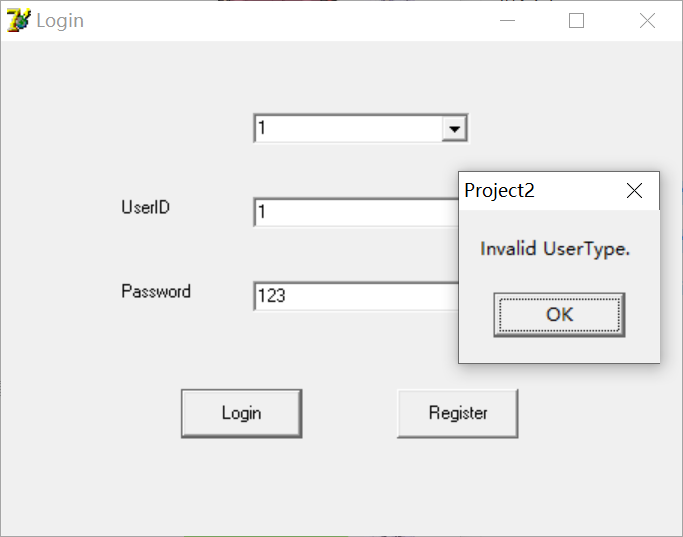

##### 2.用户或者密码错误

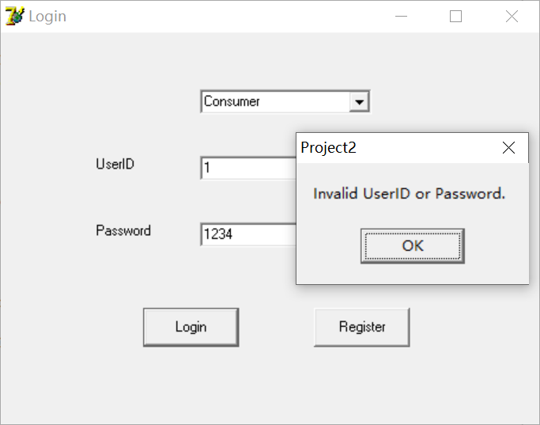

##### 3.有项目空着

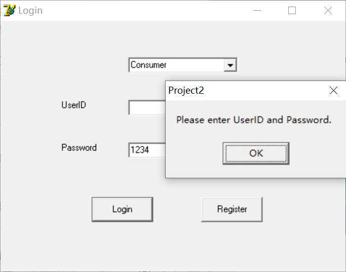

#### 示例登录流程图

1. **登录界面**
    - 用户选择用户类型（Consumer 或 Merchant）
    - 用户输入用户 ID 和密码
    - 用户点击“登录”按钮
2. **验证输入**
    - 系统检查用户输入的凭据是否有效
    - 如果凭据有效，系统允许用户登录；否则，登录失败
3. **导航用户**
    - 登录成功：系统导航用户到相应的用户界面
    - 登录失败：系统显示错误消息并要求用户重试

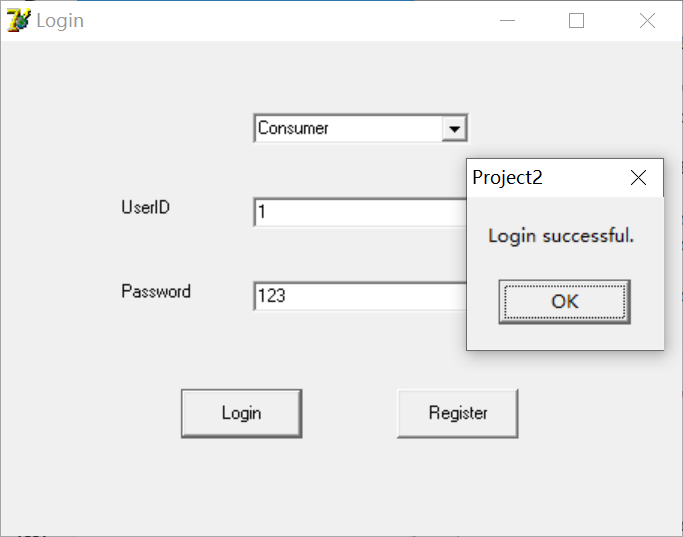

#### 用户登录功能总结

用户登录功能是用户进入应用程序的门户，通过详细的输入验证和导航用户到正确的界面，确保用户能够顺利地访问其所需的功能，并提高系统的安全性和用户体验。

### 消费者功能

#### 欢迎用户

当登陆成功进入消费者界面后，首页上会有大字欢迎消费者，而且包括了消费者的名称。当消费者ID为**123**的时候，会显示**Hello，consumer123**。

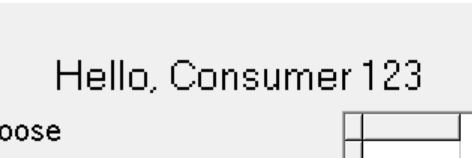

#### 查看产品

- 登录成功后，点击“查看产品”按钮。

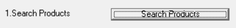

- 查询并显示所有产品及其对应的商家信息。

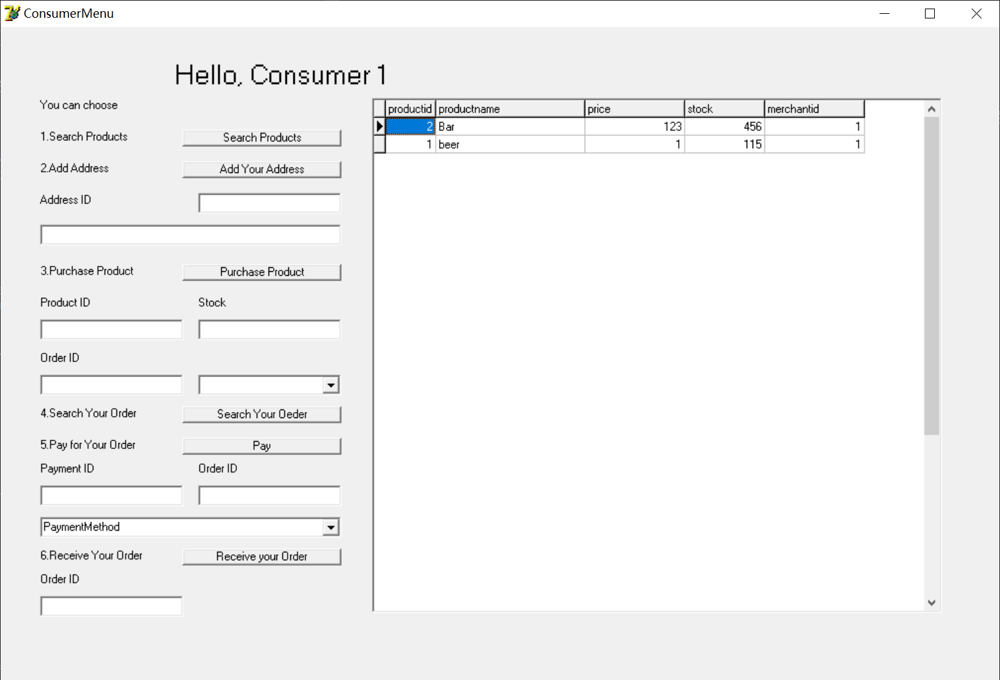

#### 添加地址

在你的应用程序中，用户可以添加新的地址信息。添加地址的过程包括输入地址 ID 和详细地址，然后点击“添加地址”按钮将新地址保存到数据库中。

##### 添加地址详细步骤

1. **输入地址 ID 和详细地址**
2. **点击“添加地址”按钮**
3. **将新地址添加到数据库**

##### 添加地址界面的功能与详细描述

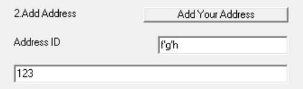

###### 1. 输入地址 ID 和详细地址

- 用户在添加地址界面输入新地址的地址 ID 和详细地址。
- 地址 ID 通常是一个唯一的标识符，用于在数据库中标识地址。
- 详细地址包括用户的具体位置信息，如街道名称、门牌号等。

###### 2. 点击“添加地址”按钮

- 用户在输入完地址信息后，点击“添加地址”按钮以提交新地址的添加请求。
- 系统会将用户输入的地址信息保存到数据库中，并反馈给用户添加地址是否成功的消息。

##### 添加地址合法性检测

- 1. 当地址ID已经存在时，会返回**Address ID Already Exists**。

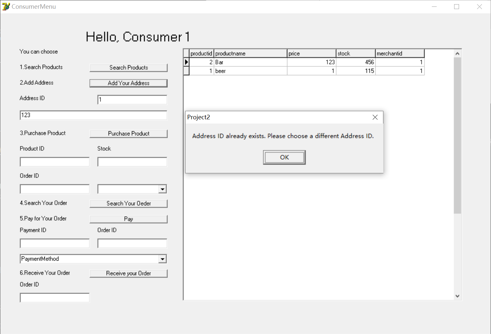

- 2. 当地址ID非法时，会返回**Invalid Address ID**。

##### 示例添加地址流程图

1. **添加地址界面**
    - 用户输入地址 ID 和详细地址
    - 用户点击“添加地址”按钮
2. **保存地址到数据库**
    - 系统将用户输入的地址信息保存到数据库中
    - 系统显示添加地址成功或失败的消息给用户
3. **添加地址成功**
    - 添加地址成功后，会显示**Add Adress Successfully**

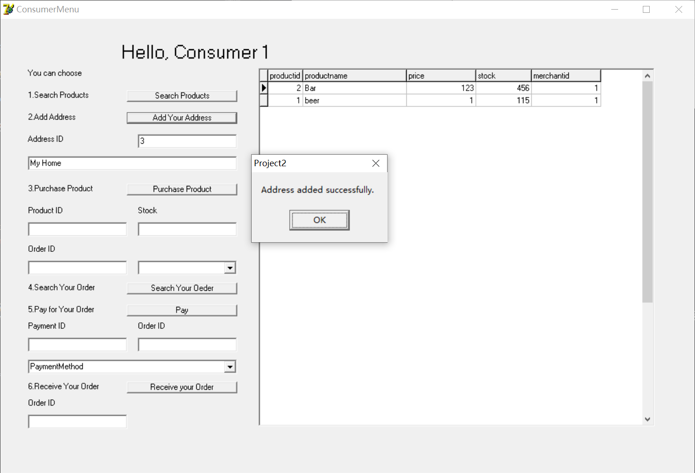

##### 添加地址功能总结

添加地址功能为用户提供了方便快捷地添加新地址的方式，通过详细的输入验证和反馈用户地址添加结果，确保用户能够顺利地管理其地址信息。

#### 购买产品

在你的应用程序中，用户可以购买产品并生成订单。购买产品的过程包括输入订单 ID、产品 ID 和购买数量，然后点击“购买产品”按钮生成订单。

##### 购买产品详细步骤

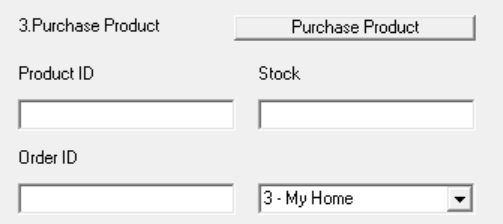

1. **输入订单 ID、产品 ID 和购买数量**
2. **选择地址**
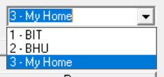
3. **点击“购买产品”按钮**
4. **生成订单**

##### 购买产品界面的功能与详细描述

###### 1. 输入订单 ID、产品 ID 和购买数量

- 用户在购买产品界面输入订单 ID、产品 ID 和购买数量。
- 订单 ID 通常是一个唯一的标识符，用于在数据库中标识订单。
- 产品 ID 是用户想要购买的产品的唯一标识符。
- 购买数量表示用户想要购买的产品数量。

###### 2. 点击“购买产品”按钮

- 用户在输入完订单信息后，点击“购买产品”按钮以提交购买请求。
- 系统会根据用户提供的订单信息生成订单，并反馈给用户订单生成是否成功的消息。

##### 合法性检测

1. 当产品不存在的时候，会返回**未找到产品**。
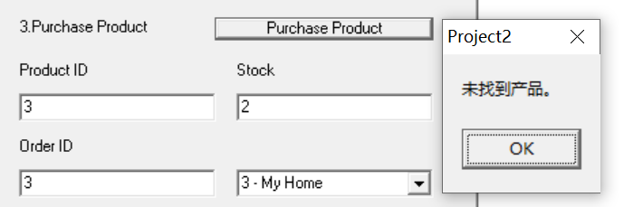
2. 当输入不合法时，会返回**输入无效**
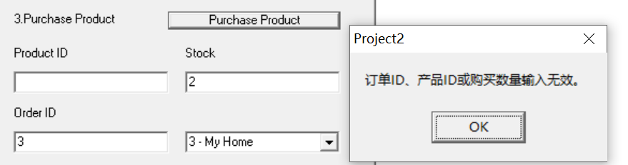
3. 当订单ID存在时，会返回**ID已存在**
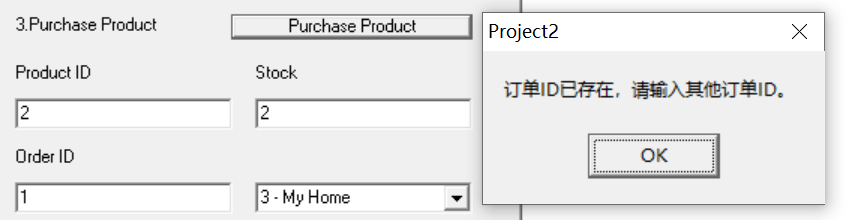

##### 示例购买产品流程图

1. **购买产品界面**
    - 用户输入订单 ID、产品 ID 和购买数量
    - 用户点击“购买产品”按钮
2. **生成订单**
    - 系统根据用户输入的订单信息生成订单
    - 系统显示订单生成成功或失败的消息给用户
3. **订单下达**
    - 当订单成功下达的时候，会返回**订单成功下达**

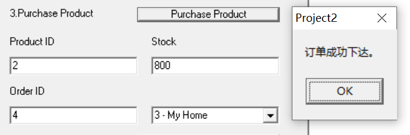

此时查询订单状态，订单状态为**待支付**。

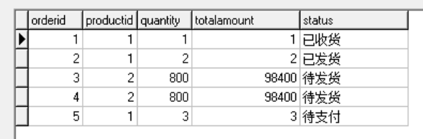

##### 购买产品功能总结

购买产品功能为用户提供了方便快捷地购买产品并生成订单的方式，通过详细的输入验证和反馈用户订单生成结果，确保用户能够顺利地完成购买流程。

#### 查询订单

在你的应用程序中，用户可以查询他们的所有订单。查询订单的过程包括点击“查询订单”按钮，然后系统显示用户的所有订单。

##### 查询订单详细步骤

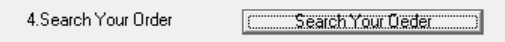

1. **点击“查询订单”按钮**
2. **查看用户的所有订单**

##### 查询订单界面的功能与详细描述

###### 1. 点击“查询订单”按钮

- 用户在查询订单界面点击“查询订单”按钮以请求查看所有订单。
- 系统会接收用户的请求并从数据库中获取用户的所有订单信息。

###### 2. 查看用户的所有订单

- 系统从数据库中获取用户的所有订单信息后，显示在用户界面上。
- 用户可以浏览所有订单的详细信息，包括订单 ID、产品 ID、购买数量、订单状态等。

##### 示例查询订单流程图

1. **查询订单界面**
    - 用户点击“查询订单”按钮
2. **获取订单信息**
    - 系统从数据库中获取用户的所有订单信息
3. **显示订单信息**
    - 系统显示用户的所有订单信息

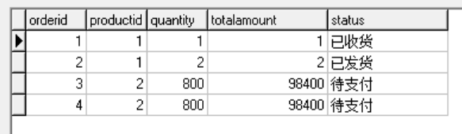

##### 查询订单功能总结

查询订单功能为用户提供了方便快捷地查看其所有订单的方式，通过简单的操作步骤和详细的信息展示，确保用户能够轻松地管理和查看其订单信息。

#### 支付订单

在你的应用程序中，用户可以通过输入支付信息来支付订单。支付订单的过程包括输入支付 ID、订单 ID 和支付方式，然后点击“支付”按钮完成支付，并更新订单状态为“待发货”。

##### 支付订单详细步骤

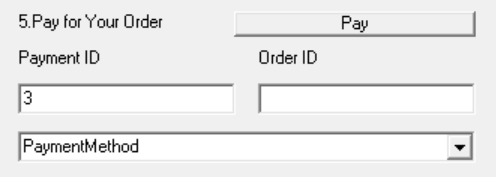

1. **输入支付 ID、订单 ID 和支付方式**
2. **点击“支付”按钮**
3. **完成支付并更新订单状态**

##### 支付订单界面的功能与详细描述

###### 1. 输入支付 ID、订单 ID 和支付方式

- 用户在支付订单界面输入支付 ID、订单 ID 和支付方式。
- 支付 ID 通常是一个唯一的标识符，用于在数据库中标识支付记录。
- 订单 ID 是用户想要支付的订单的唯一标识符。
- 支付方式可以是多种选项，如信用卡、借记卡、在线支付等。

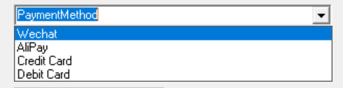

###### 2. 点击“支付”按钮

- 用户在输入完支付信息后，点击“支付”按钮以提交支付请求。
- 系统会处理支付请求，并验证支付信息的有效性。

###### 3. 完成支付并更新订单状态

- 如果支付成功，系统会将订单状态更新为“待发货”。
- 系统会显示支付成功的消息给用户。

##### 非法输入处理

- 1. 当输入订单空或者无效的时候，会返回**订单无效**。

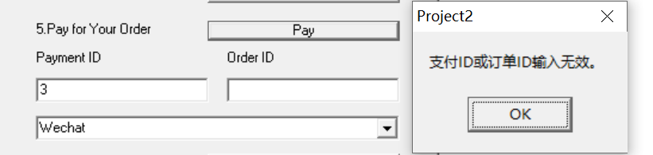

- 2. 当输入的PaymentID重复的时候，会返回**支付ID已存在**。

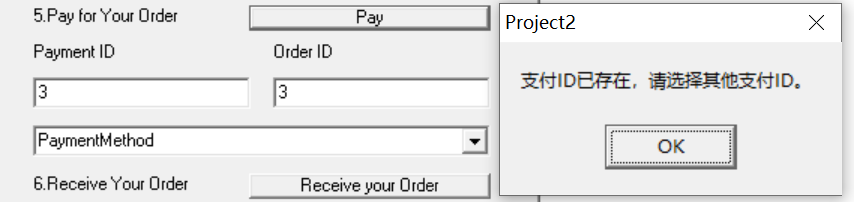

- 3. 当订单状态不可支付时，会返回**该订单状态不可支付**。

##### 示例支付订单流程图

1. **支付订单界面**
    - 用户输入支付 ID、订单 ID 和支付方式
    - 用户点击“支付”按钮
2. **处理支付请求**
    - 系统处理支付请求并验证支付信息
3. **更新订单状态**
    - 如果支付成功，系统将订单状态更新为“待发货”
    - 系统显示支付成功或失败的消息给用户

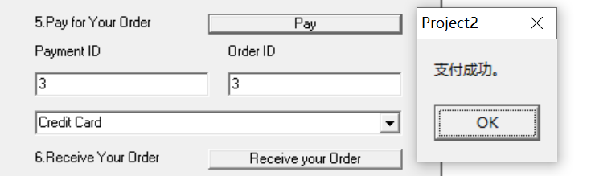

此时查询订单状态，订单状态为**待发货**。

##### 支付订单功能总结

支付订单功能为用户提供了方便快捷地完成订单支付的方式，通过详细的输入验证和订单状态更新，确保用户能够顺利地完成支付流程，并实时了解订单状态。

#### 确认收货

在你的应用程序中，用户可以确认收货并更新订单状态为“已收货”。确认收货的过程包括输入订单 ID，然后点击“确认收货”按钮将订单状态更新为“已收货”。

##### 确认收货详细步骤

1. **输入订单 ID**
2. **点击“确认收货”按钮**
3. **更新订单状态为“已收货”**

##### 确认收货界面的功能与详细描述

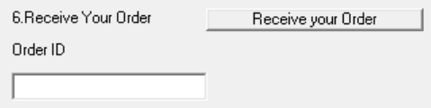

###### 1. 输入订单 ID

- 用户在确认收货界面输入待确认收货的订单 ID。

###### 2. 点击“确认收货”按钮

- 用户在输入完订单 ID 后，点击“确认收货”按钮以提交确认收货请求。
- 系统会将订单状态更新为“已收货”。

##### 订单ID非法输入处理

- 1. 当输入订单空或者无效的时候，会返回**Invalid Order ID**。

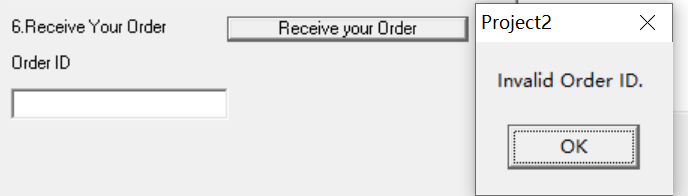

- 2. 当输入的订单不存在的时候，会返回**Order Not Found**。

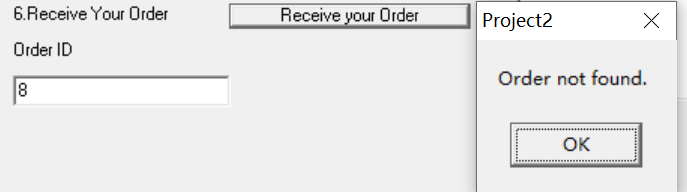

- 3. 当订单状态不可收货时，会返回**Only orders with status "Delivered" can be received.**。

##### 示例确认收货流程图

1. **确认收货界面**
    - 用户输入订单 ID
    - 用户点击“确认收货”按钮
2. **更新订单状态**
    - 系统将订单状态更新为“已收货”

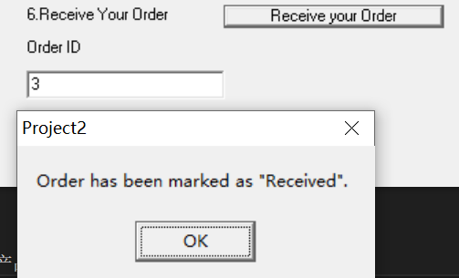

此时查询订单状态，订单状态为**已收货**。

##### 确认收货功能总结

确认收货功能为用户提供了确认收到商品并更新订单状态的方式，通过简单的输入操作和订单状态更新，确保用户能够方便地完成确认收货的流程，并及时更新订单状态。

### 商家功能

#### 查看商品

在你的应用程序中，用户可以通过点击“查看产品”按钮来浏览商家相关的产品。查看商品的过程包括登录成功后，点击“查看产品”按钮，然后系统会查询并显示商家相关的产品信息。

##### 查看商品详细步骤

1. **登录成功后，点击“查看产品”按钮**
2. **查询并显示商家相关的产品**

##### 查看商品界面的功能与详细描述

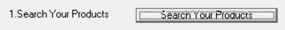

###### 1. 登录成功后，点击“查看产品”按钮

- 用户在登录成功后，可以点击界面上的“查看产品”按钮以浏览商家相关的产品。
- 系统会接收用户的请求并进行相应的查询。

###### 2. 查询并显示商家相关的产品

- 系统会从数据库中查询商家相关的产品信息，并在界面上显示出来。
- 用户可以浏览所有产品的详细信息，如产品名称、价格、描述等。

##### 示例查看商品流程图

1. **查看商品界面**
    - 用户登录成功后，点击“查看产品”按钮
2. **查询商品信息**
    - 系统从数据库中获取商家相关的产品信息
3. **显示商品信息**
    - 系统显示商家相关的产品信息给用户

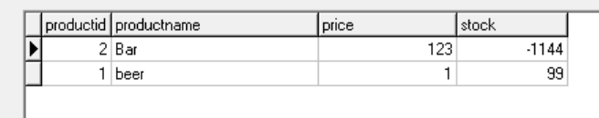

##### 查看商品功能总结

查看商品功能为用户提供了方便快捷地浏览商家相关产品的方式，通过简单的操作步骤和详细的信息展示，确保用户能够轻松地了解商家提供的产品信息。

#### 添加产品

在你的应用程序中，商家可以通过添加产品界面将新产品添加到数据库中。添加产品的过程包括输入产品 ID、产品名称、价格和库存，然后点击“添加产品”按钮提交信息。

##### 添加产品详细步骤

1. **输入产品 ID、产品名称、价格和库存**
2. **点击“添加产品”按钮**
3. **将新产品添加到数据库**

##### 添加产品界面的功能与详细描述

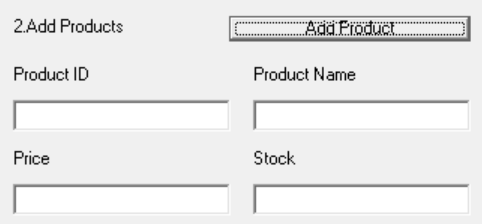

###### 1. 输入产品 ID、产品名称、价格和库存

- 商家在添加产品界面输入新产品的相关信息。
  - 产品 ID：唯一标识一个产品的标识符。
  - 产品名称：产品的名称。
  - 价格：产品的价格。
  - 库存：产品的库存数量。

###### 2. 点击“添加产品”按钮

- 商家在输入完所有产品信息后，点击“添加产品”按钮以提交新产品的添加请求。
- 系统会验证输入的合法性，并将新产品信息保存到数据库中。

##### 添加产品合法性检测

- 1. 当有一部分为空的时候，会显示**cannot be empty**

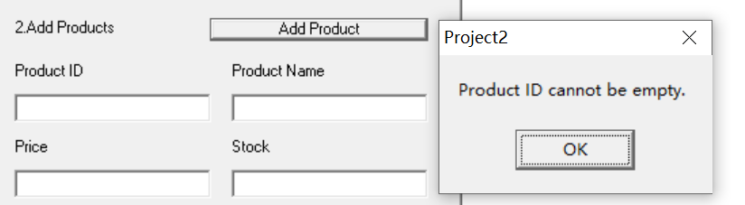

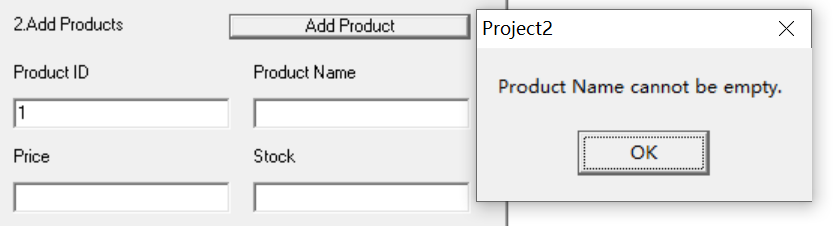

- 2. 当price的输入为非法的时候，会显示**Invalid Price**。

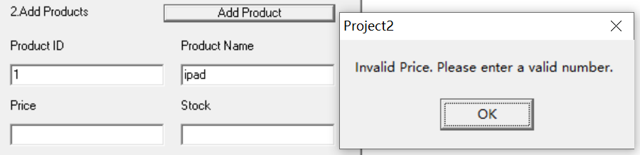

- 3. 当Stock的输入为非法的时候，会显示**Invalid Stock**。

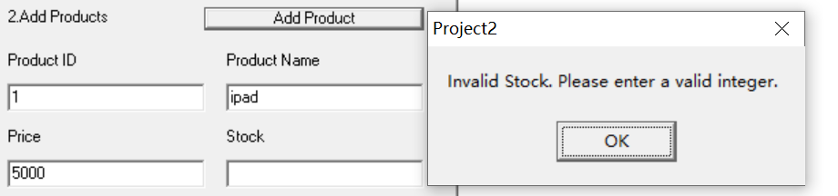

- 4. 当输入的产品ID已经存在时，系统会返回相应的错误信息，例如 **ProductID Already Exists**。

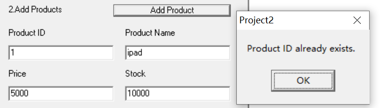

##### 示例添加产品流程图

1. **添加产品界面**
    - 商家输入产品 ID、产品名称、价格和库存
    - 商家点击“添加产品”按钮
2. **保存产品到数据库**
    - 系统验证输入信息的合法性
    - 系统将新产品信息保存到数据库中
3. **反馈商家**
    - 添加成功：显示“添加产品成功”消息
    - 添加失败：显示具体的错误信息，提示商家需要修改的内容

当成功添加新产品的时候，就会反馈**Product Added Successfully**

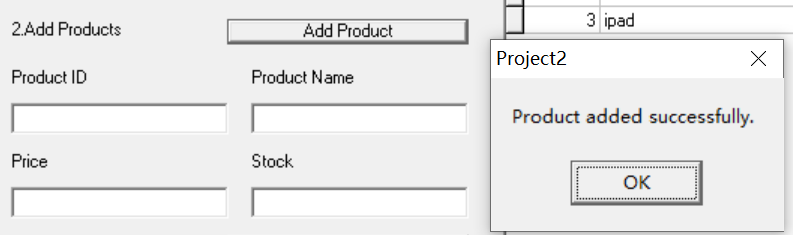

与此同时，右侧显示部分同时也会显示包括新的商品的商品清单。

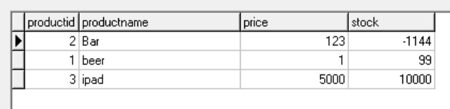

##### 添加产品功能总结

添加产品功能为商家提供了方便快捷地添加新产品的方式，通过详细的输入验证和反馈商家添加结果，确保商家能够顺利地管理其产品信息，并提高系统的安全性和用户体验。

#### 查询商单

在你的应用程序中，商家可以通过点击“查询订单”按钮来查看所有订单。查询商单的过程包括点击“查询订单”按钮，系统查询商家所有的订单，并在界面上显示订单信息。

##### 查询商单详细步骤

1. **点击“查询订单”按钮**
2. **查询并显示商家所有订单**

##### 查询商单界面的功能与详细描述

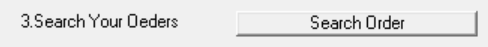

###### 1. 点击查询订单按钮

- 商家在界面上点击“查询订单”按钮以查看所有订单。
- 系统接收到请求后，开始查询订单信息。

###### 2. 查询并显示商家所有订单

- 系统从数据库中查询该商家所有的订单信息。
- 查询结果会显示在界面上，包括订单 ID、订单状态、产品信息、购买数量等详细信息。

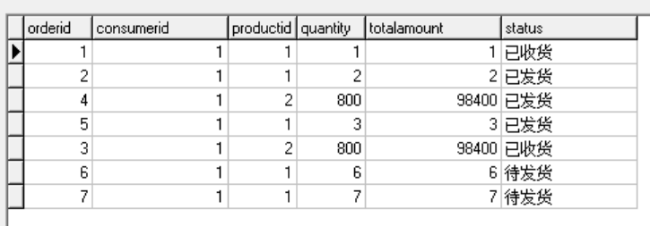

##### 示例查询商单流程图

1. **查询订单界面**
    - 商家点击“查询订单”按钮
2. **获取订单信息**
    - 系统从数据库中查询商家的所有订单信息
3. **显示订单信息**
    - 系统显示订单信息给商家

##### 查询商单功能总结

查询商单功能为商家提供了便捷地查看所有订单信息的方式，通过简单的操作步骤和详细的信息展示，确保商家能够轻松地管理和查看所有订单。

#### 订单发货

在你的应用程序中，商家可以通过订单发货界面更新订单的状态。发货过程包括输入订单 ID，点击“发货”按钮，然后系统将订单状态更新为“已发货”。

##### 订单发货详细步骤

1. **输入订单 ID**
2. **点击“发货”按钮**
3. **更新订单状态为“已发货”**

##### 订单发货界面的功能与详细描述

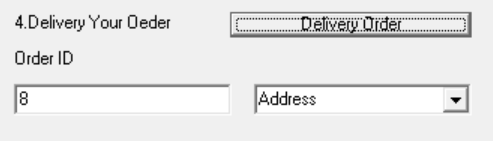

###### 1. 输入订单ID

- 商家在订单发货界面输入需要发货的订单 ID。
- 订单 ID 是唯一标识一个订单的标识符。

###### 2. 点击“发货”按钮

- 商家在输入订单 ID 后，点击“发货”按钮提交订单发货请求。
- 系统会验证输入的订单 ID，并检查订单状态是否允许发货。

###### 3. 更新订单状态为“已发货”

- 系统将符合条件的订单状态更新为“已发货”。
- 系统会显示订单状态更新成功或失败的消息。

##### 订单发货合法性检测

- 1. 当订单 ID 非法时，系统会返回 **Invalid Order ID** 错误。
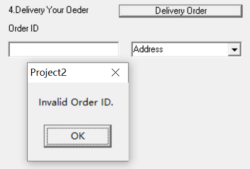

- 2. 当订单 ID 不存在时，系统会返回 **Order ID Not Found** 错误。

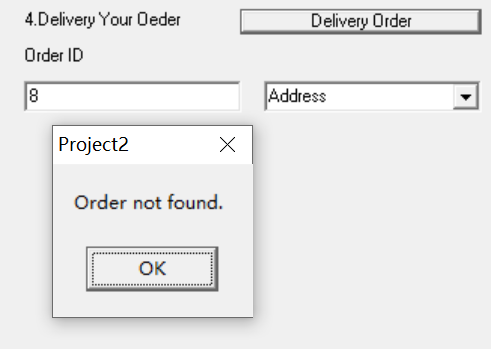!

- 3. 当订单状态不允许发货时，系统会返回 **Order Cannot Be Shipped** 错误。

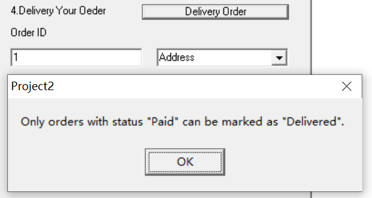

##### 示例订单发货流程图

1. **订单发货界面**
    - 商家输入订单 ID
    - 商家点击“发货”按钮
2. **验证订单信息**
    - 系统检查订单 ID 是否存在
    - 系统检查订单状态是否允许发货
3. **更新订单状态**
    - 系统将订单状态更新为“已发货”
4. **反馈商家**
    - 发货成功：显示“订单已发货”消息
    - 发货失败：显示具体的错误信息，提示商家需要修改的内容
  

成功发货后，查询订单就能显示订单状态被标记为已发货

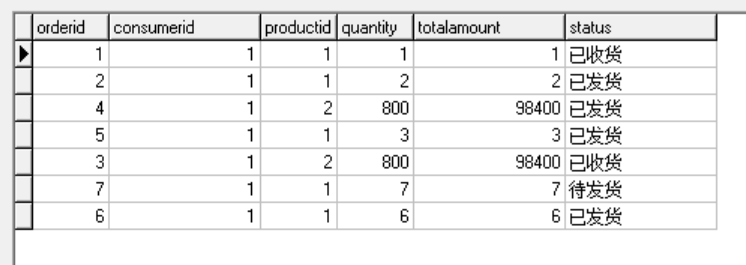

##### 订单发货功能总结

订单发货功能为商家提供了便捷地更新订单状态的方式，通过详细的输入验证和反馈商家订单状态更新结果，确保商家能够顺利地管理和更新订单信息。

## 故障排除

### 1. **登录问题**

- **检查用户名和密码**：确保输入的用户名和密码正确无误。
- **网络连接**：确认您的设备已连接到互联网。
- **浏览器设置**：尝试使用其他浏览器或清理浏览器缓存。
- **软件更新**：确保您的应用程序是最新的版本。

### 2. **注册问题**

- **输入验证**：确认所有必填字段都已填写，且格式正确。
- **唯一性检查**：确保用户名和密码是唯一的。
- **用户类型选择**：确认选择了正确的用户类型（Consumer 或 Merchant）。

### 3. **购买产品问题**

- **产品信息**：确认产品ID和订单ID是正确的。
- **购买数量**：确认购买数量输入正确。
- **支付信息**：确认支付ID和支付方式正确无误。

### 4. **查询订单问题**

- **查询按钮**：确认已点击“查询订单”按钮。
- **订单信息**：确认订单ID输入正确。

### 5. **地址管理问题**

- **地址信息**：确认地址ID和详细地址输入正确。
- **添加地址**：确认已点击“添加地址”按钮。

### 6. **支付订单问题**

- **支付信息**：确认支付ID、订单ID和支付方式输入正确。
- **支付按钮**：确认已点击“支付”按钮。

### 7. **确认收货问题**

- **订单信息**：确认订单ID输入正确。
- **确认收货**：确认已点击“确认收货”按钮。

### 8. **添加产品问题**

- **产品信息**：确认产品ID、名称、价格和库存输入正确。
- **添加按钮**：确认已点击“添加产品”按钮。

### 9. **查询商单问题**

- **查询按钮**：确认已点击“查询订单”按钮。
- **订单信息**：确认订单ID输入正确。

### 10. **订单发货问题**

    - **订单信息**：确认订单ID输入正确。
    - **发货按钮**：确认已点击“发货”按钮。

以上是一些常见的故障排除步骤，如果遇到其他问题，可以参考用户手册中的相关章节，或联系我们的技术支持团队。

## 常见问题

### 1. **登录问题**

    - 为什么我无法登录？
      - 请检查您的用户名和密码是否正确无误，并确保它们符合规定的格式要求。
      - 确认您的网络连接稳定，没有断开。
      - 尝试清除浏览器缓存或使用其他浏览器登录。
      - 检查您的账户是否被禁用或锁定。

### 2. **注册问题**

    - 我无法注册新账户？
      - 请确认所有必填字段都已填写，并且输入的格式正确。
      - 用户名和密码必须唯一，并且符合复杂度要求。
      - 选择正确的用户类型（Consumer 或 Merchant）。

### 3. **购买产品问题**

    - 为什么我的订单没有成功？
      - 请确认产品ID和订单ID输入正确，购买数量符合要求。
      - 支付信息必须准确无误，包括支付ID和支付方式。

### 4. **查询订单问题**

    - 我无法查询我的订单？
      - 请确认已点击“查询订单”按钮，并且输入了正确的订单ID。

### 5. **地址管理问题**

        - 我无法添加新的地址？
        - 请确认地址ID和详细地址输入正确，并且地址ID是唯一的。
        - 尝试添加地址，并确保已点击“添加地址”按钮。

### 6. **支付订单问题**

    - 我的支付失败了？
      - 请确认支付ID、订单ID和支付方式输入正确。
      - 尝试重新输入支付信息，并确保已点击“支付”按钮。

### 7. **确认收货问题**

    - 我无法确认收货？
      - 请确认订单ID输入正确。
      - 尝试重新输入订单ID，并确保已点击“确认收货”按钮。

### 8. **添加产品问题**

    - 我无法添加新产品？
      - 请确认产品ID、名称、价格和库存输入正确。
      - 尝试添加产品，并确保已点击“添加产品”按钮。

### 9. **查询商单问题**

    - 我无法查询我的商单？
      - 请确认已点击“查询订单”按钮，并且输入了正确的订单ID。

### 10. **订单发货问题**

    - 我的订单没有发货？
      - 请确认订单ID输入正确。
      - 尝试重新输入订单ID，并确保已点击“发货”按钮。

以上是一些常见的用户问题，如果遇到其他问题，可以参考用户手册中的相关章节，或联系我们的技术支持团队。

## 联系支持

如果您在使用本软件过程中遇到任何问题或需要帮助，请通过以下方式联系我们的支持团队：

- **电话**：198-8355-7844
- **邮箱**：<1120221303@bit.edu.cn>
- **工作时间**：周一至周五，9:00 - 18:00
