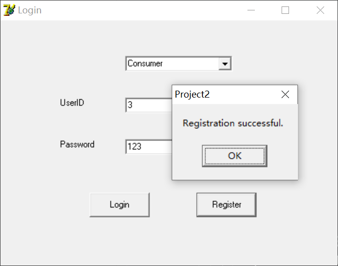
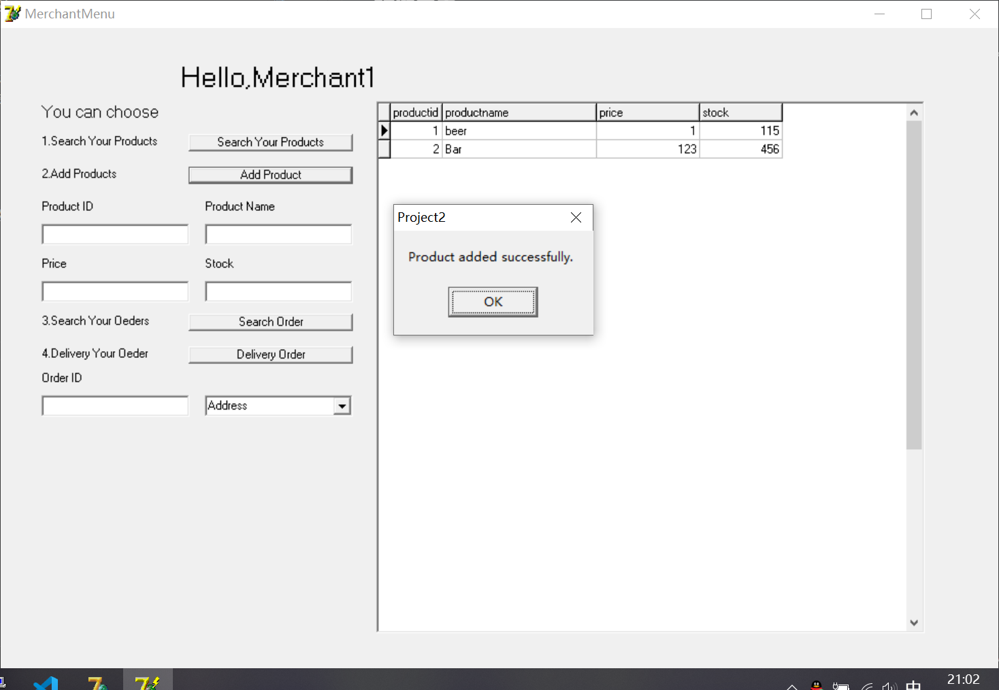
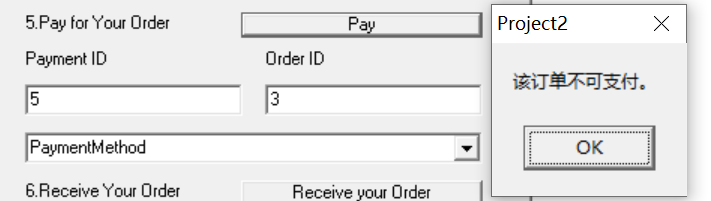
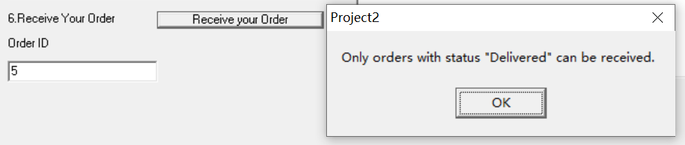
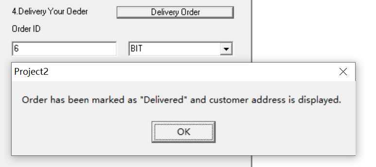

# Assignment3加分申请

## 姓名：俞乐楠
## 学号：1120221303
## 项目：电子商务管理系统

### 项目介绍

我的项目是一个电子商务管理系统，旨在为消费者和商家提供一个高效、便捷的购买和销售平台。该系统具有以下主要功能：

- 用户注册和登录：支持消费者和商家注册账号，并提供安全的登录功能。
- 商品搜索：允许用户通过关键字搜索商品，并提供相关推荐功能。
- 订单管理：用户可以查看和管理自己的订单，包括下单、取消订单等操作。
- 支付处理：提供多种支付方式，并保障支付安全性。
- 地址管理：用户可以添加、编辑和删除收货地址，提升购物体验。

### 项目优点

我的项目具有以下优点：

1. **功能完善**：实现了用户注册登录、商品搜索、订单管理、支付处理、地址管理等一系列完整的电子商务功能，满足了用户的基本需求。

2. **安全性高**：采用了安全的用户认证和支付处理机制，保障了用户的信息和资金安全。

3. **交易效率高**：通过优化的界面设计和快速的数据库查询，提高了交易效率，减少了用户等待时间。

4. **用户体验好**：界面友好，操作简单，提供了多种便捷的功能，使用户体验更加舒适。友好的系统界面与交互。

5. **技术丰富**：项目中应用了数据库规范化、存储过程、触发器等数据库技术，展现了我对数据库管理的深入理解和应用能力。

6. **超强鲁棒性**：面对各种非法输入，我的项目能够快速识别并处理，确保系统的稳定性和安全性。

以上是我项目的介绍及其优点，希望老师能够考虑给予额外加分。谢谢您的审阅和支持！

## 四、结论
1. **总结**
    - 本次任务不仅达到了基本的设计与实现要求，还在多个方面超出了基本要求，充分体现了我们的自学能力和创造能力
    - 以上加分项的实现使得系统更加完善和实用，期望能够获得相应的加分
