# GaussDB内核剖析

## 目录

- [GaussDB内核剖析](#gaussdb内核剖析)
  - [目录](#目录)
  - [1. 引言](#1-引言)
    - [1.1 简介](#11-简介)
      - [1.1.1 什么是GaussDB](#111-什么是gaussdb)
      - [1.1.2 GaussDB的主要功能和应用场景](#112-gaussdb的主要功能和应用场景)
      - [1.1.3 GaussDB和openGauss的历史](#113-gaussdb和opengauss的历史)
    - [1.2 文章目标](#12-文章目标)
  - [2. GaussDB概述](#2-gaussdb概述)
    - [2.1 历史背景](#21-历史背景)
    - [2.2 数据库市场的主要需求和痛点](#22-数据库市场的主要需求和痛点)
    - [2.3 系统架构](#23-系统架构)
  - [3. 内核架构](#3-内核架构)
    - [3.1 进程模型](#31-进程模型)
    - [3.2 存储引擎](#32-存储引擎)
    - [3.3 执行引擎](#33-执行引擎)
  - [4. 关键技术](#4-关键技术)
    - [4.1 分布式架构](#41-分布式架构)
    - [4.2 高可用性](#42-高可用性)
    - [4.3 安全性](#43-安全性)
  - [5. 性能优化](#5-性能优化)
    - [5.1 缓存管理](#51-缓存管理)
    - [5.2 并发控制](#52-并发控制)
    - [5.3 查询优化](#53-查询优化)
  - [6. 实践案例](#6-实践案例)
    - [6.1 部署与运维](#61-部署与运维)
    - [6.2 性能调优实例](#62-性能调优实例)
  - [7. 未来展望](#7-未来展望)
    - [7.1 新技术趋势](#71-新技术趋势)
    - [7.2 GaussDB的发展方向](#72-gaussdb的发展方向)
  - [8. 总结](#8-总结)
  - [参考文献](#参考文献)

## 1. 引言

### 1.1 简介

#### 1.1.1 什么是GaussDB

GaussDB是华为公司推出的一系列自研数据库产品，正式发布于2019年5月15日。以德国数学家高斯命名，代表了华为在数据库技术领域的自主创新和技术积累。华为GaussDB是华为鲲鹏生态的主力军之一。[^1]

GaussDB是基于华为20余年战略投入、软硬全栈协同所创新研发的分布式关系型数据库，具备高可用、高性能、高安全、高弹性、高智能、易部署、易迁移等关键能力，是企业核心业务数字化转型升级的坚实数据底座。

GaussDB系列产品包括关系型数据库和非关系型数据库，针对不同的应用场景提供了多种解决方案。它们在华为云和华为云Stack上运行，支持从事务处理（OLTP）到数据分析（OLAP）的全场景服务。

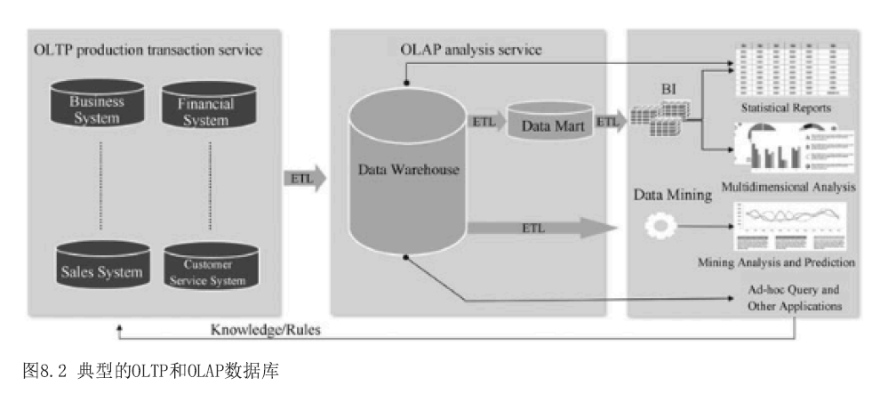

#### 1.1.2 GaussDB的主要功能和应用场景

GaussDB的主要功能包括：

1. **AI原生分布式数据库**：GaussDB是业界首个将AI深度融合到数据库内核中的分布式数据库。它实现了数据库的自运维、自管理、自调优、故障自诊断和自愈能力，通过深度强化学习的自调优算法，在事务、分析和混合负载场景下提供了优化的解决方案。
2. **异构计算架构**：GaussDB支持多种计算架构（如X86GPU和NPU），充分利用多样的计算能力，提高数据库的效率。它是业界首个支持ARM架构的企业级数据库。
3. **高性能和高可用性**：GaussDB提供高吞吐量和强一致性的事务处理能力，支持主动-主动和两地三中心的高可用部署，确保在集群内部和跨区域的灾备能力，无数据丢失，支持秒级业务中断恢复。
4. **兼容性和易管理性**：GaussDB兼容SQL2003标准语法和企业扩展包，支持数据复制、监控运维和工具开发。它简化了迁移、监控和运维工作。
5. **弹性扩展能力**：GaussDB支持按需的容量和性能横向扩展，能够线性扩展到256个节点，提供出色的线性比率和在线扩展能力。

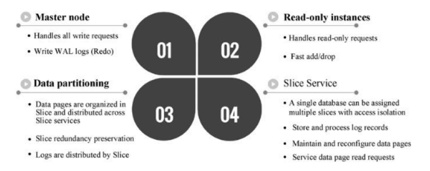

GaussDB的应用场景广泛，包括但不限于：

- **企业生产和交易系统（OLTP）**：如企业资源规划（ERP）和客户关系管理（CRM）系统。
- **数据分析和商业智能（OLAP）**：如数据仓库和大数据分析平台。
- **互联网和移动应用**：如社交媒体、电子商务和内容管理系统。
- **物联网（IoT）和大规模数据处理**：如车辆联网和工业制造中的大规模数据存储和处理。

通过这些功能和应用场景，GaussDB不仅提升了数据库系统的性能和智能化水平，也为企业在数字化转型过程中提供了强有力的支持。

#### 1.1.3 GaussDB和openGauss的历史

<table>
  <tr>
    <th>时间</th>
    <th>作用</th>
  </tr>
  <tr>
    <td>2001 - 2011</td>
    <td>企业级内存数据库</td>
  </tr>
  <tr>
    <td>2011 - 2019</td>
    <td>G Line核心数据仓库, GaussDB (DWS) 华为云商用；用Z Line核心业务系统替换商业数据库。支持公司内部40多种关键产品，全球运营商达到70余家，商业数据库3万多套，服务全球超过20亿人口</td>
  </tr>
  <tr>
    <td>2019 - 2020</td>
    <td>GaussDB数据库于2019年5月15日全球发布；合作伙伴生态搭建；兼容主流行业生态，对接金融等行业</td>
  </tr>
  <tr>
    <td>2020年至今</td>
    <td>openGauss集中版开源</td>
  </tr>
</table>

### 1.2 文章目标

本文的主要目标是对GaussDB数据库的内核架构进行深入分析，并详细介绍其核心组件和机制。具体而言，本文将从以下几个方面展开讨论：

1. **分析GaussDB的内核架构**：

 - 通过对GaussDB的架构设计进行全面解析，揭示其在系统设计上的独特之处。
 - 讨论GaussDB如何在架构层面实现高性能、高可用性和扩展性。
 - 探讨GaussDB在分布式系统中的架构优势及其对业务连续性的保障。

2. **介绍核心组件和机制**：

 - 深入研究GaussDB的关键模块，包括事务处理、存储引擎和查询优化器。
 - 解析各核心组件的工作原理及其在数据库操作中的角色。
 - 介绍GaussDB的并发控制、数据存储和优化策略，展示其在复杂应用场景下的性能表现。

通过这些分析和介绍，本文旨在帮助读者全面了解GaussDB的技术优势和创新点，为其在实际应用中的选择和部署提供理论支持和技术指导。

## 2. GaussDB概述

### 2.1 历史背景

- **GaussDB的发展历程**
  GaussDB是华为自主研发的数据库产品系列，于2019年5月15日正式发布。该系列产品以德国数学家高斯的名字命名，展示了华为在数据库技术领域的多年积累和创新成果。GaussDB家族包括关系型数据库和非关系型数据库，适用于各种场景。

- **GaussDB在数据库市场中的地位**
  在数据库市场中，关系型数据库仍占据主要市场份额，超过80%。GaussDB通过推出OLTP和OLAP场景下的数据库产品，如GaussDB(for MySQL)和GaussDB(DWS)，并创新性地引入AI-Native分布式架构和异构计算架构，迅速占据了一席之地。它的自我调优算法和ARM企业级数据库支持，进一步提升了其市场竞争力。

### 2.2 数据库市场的主要需求和痛点

| 点                 | 需求描述                             |
| ------------------ | ------------------------------------ |
| 兼容MySQL          | 无需对原有MySQL应用程序进行任何修改  |
| 海量数据存储       | 支持大数据量的互联网服务             |
| 分布式且高度可扩展 | 自动化分库分表或无分库分表，应用透明 |
| 交易强一致性       | 支持分布式事务的强一致性             |
| 高可用             | 支持跨AZ、高可用、跨地域容灾         |
| 高并发性能         | 支持大并发场景下的高性能             |
| 非中间件架构       | 非DDM解决方案（或非DRDS解决方案）    |

### 2.3 系统架构

- **总体架构**
GaussDB的架构设计充分考虑了云计算和大数据处理的需求，采用分布式和模块化设计。其核心架构包括计算层、存储层和管理层，各层之间通过高效的网络通信进行数据交换。

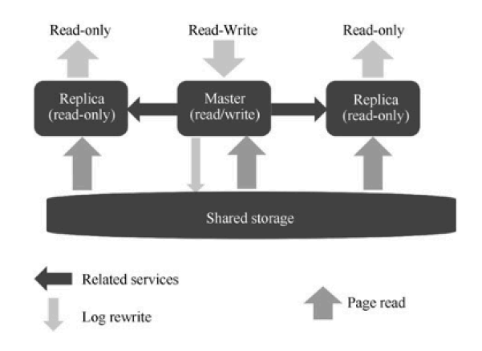

| 层级   | 描述                                                                                                                                                                                                                         |
| ------ | ---------------------------------------------------------------------------------------------------------------------------------------------------------------------------------------------------------------------------- |
| SQL层  | 负责执行 SQL 查询和数据处理任务，支持多种计算模式，包括事务处理和分析处理。通过引入 AI 技术，实现自我优化和自我修复。同时，华为还推出了HWSQL，并在HWSQL的基础上做了很多性能改进，包括查询结果存储、查询计划缓存、在线SQL等。 |
| 存储层 | 提供高性能、高可靠的存储服务，支持大规模数据存储和快速读写操作。采用计算存储分离架构，实现按需扩展和高效的数据管理。                                                                                                         |
| 抽象层 | 负责系统的整体监控、调度和管理，提供完善的运维工具和管理接口，实现自动化运维和智能化管理。                                                                                                                                   |

整个设计的独特之处在于通过多个节点的SQL赋值减少了频繁的从内存读取页面，从而提高了系统的性能。当主服务器上发生更新时，副本SQL会自动更新，从而实现了主从服务器之间的数据同步。

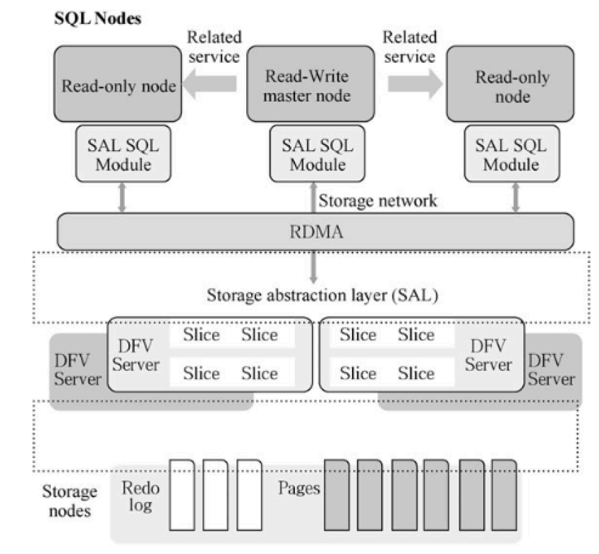

## 3. 内核架构

openGauss的内核原子PostgresSQL，专注在架构、事务、储存引擎和查询优化。再ARM架构下，openGauss的性能进行了深度优化，兼容X86架构，支持多种数据库应用场景。[^2]

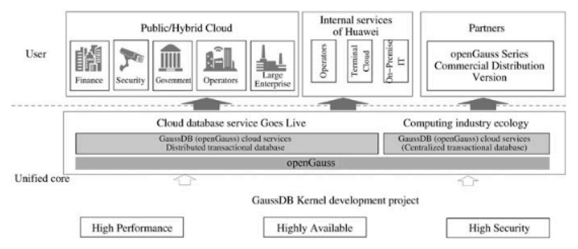

### 3.1 进程模型

- 进程和线程的设计
GaussDB采用多进程和多线程结合的模型，以充分利用现代多核处理器的性能。[^3]主进程负责数据库的总体管理和调度，每个客户端连接由单独的进程处理，从而保证了进程之间的隔离和独立性。线程则主要用于处理复杂计算任务和并行操作，以提高执行效率。
- 进程间通信（IPC）机制
在GaussDB中，进程间通信（IPC）是通过共享内存、信号和消息队列实现的。共享内存用于在进程间高效传递大量数据，信号用于进程间的同步与控制，消息队列则用于进程间的消息传递和任务调度。这些机制的结合保证了系统的高效运行和稳定性。

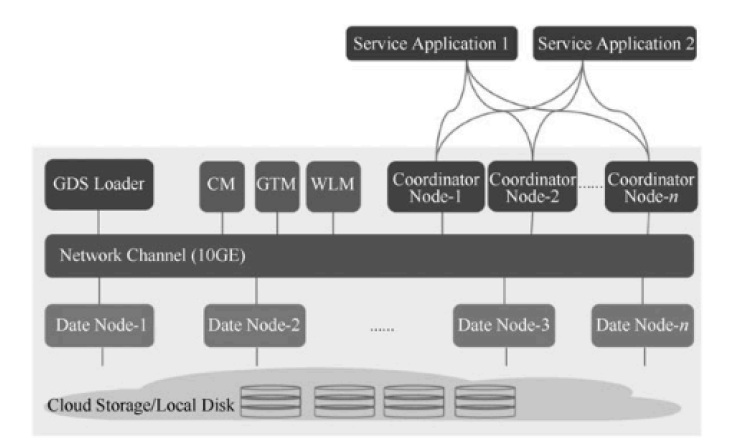

### 3.2 存储引擎

- 数据存储格式
GaussDB支持多种数据存储格式，包括行存储和列存储。行存储适用于OLTP（在线事务处理）场景，提供快速的记录读取和写入能力。列存储则适用于OLAP（在线分析处理）场景，提供高效的数据压缩和查询性能。
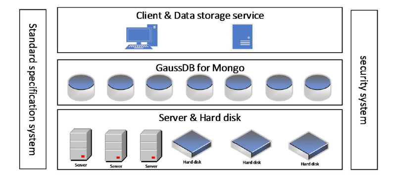
- 索引结构
GaussDB使用多种索引结构以提高查询性能，包括B树索引、哈希索引和GIN（通用倒排索引）等。B树索引适用于范围查询和排序操作，哈希索引适用于等值查询，而GIN索引则适用于全文搜索和多值属性的查询。
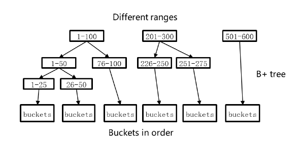
- 存储管理
存储管理模块负责数据的物理存储和逻辑管理。它包括数据块的分配与回收、日志管理和数据压缩等功能。通过智能的数据块管理和多级缓存机制，GaussDB实现了高效的存储利用率和快速的数据访问速度。

### 3.3 执行引擎

- 查询执行流程
GaussDB的查询执行流程包括查询解析、语法分析、优化、执行和结果返回等步骤。查询首先被解析为抽象语法树，然后经过优化器生成最优的执行计划，最终由执行器按照计划执行并返回结果。
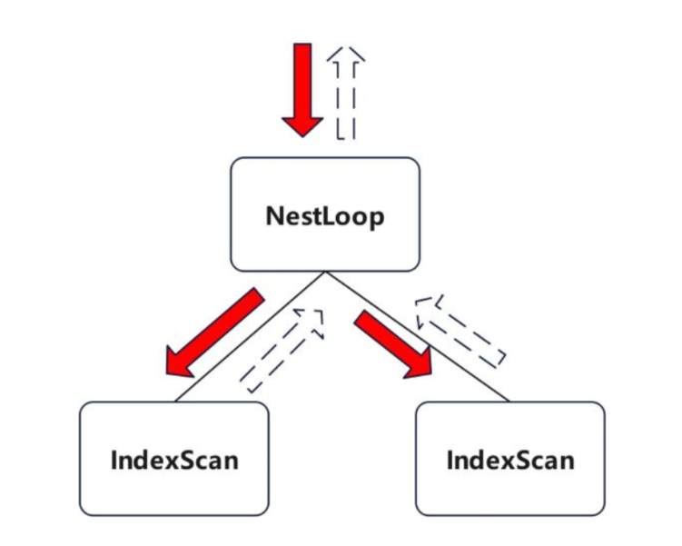
- 执行计划生成与优化
优化器是GaussDB执行引擎的核心组件，负责生成高效的执行计划。它通过代价估算和规则变换对查询进行优化，包括选择最佳的连接顺序、索引使用策略和并行执行方案。优化器的目标是最小化查询的执行时间和资源消耗。
- 执行器
执行器负责执行查询计划，包括执行算子、处理数据、执行事务和处理异常等。执行器采用多线程和多进程的并行执行模型，以提高查询的执行效率。

## 4. 关键技术

### 4.1 分布式架构

GaussDB(DWS)是分布式、按需的，具有分布不是架主备/多活设计的高可靠性、存储与计算分离、高扩展性、高可用性、高安全性的数据库。符合标准SQL 2003，支持事务ACID特性，提供强有力的数据一致性保证；支持X86和ARM架构，支持多种数据库应用场景。基于鲲鹏芯片进行垂直优化，相比同代X86性能提升30%。[^4]
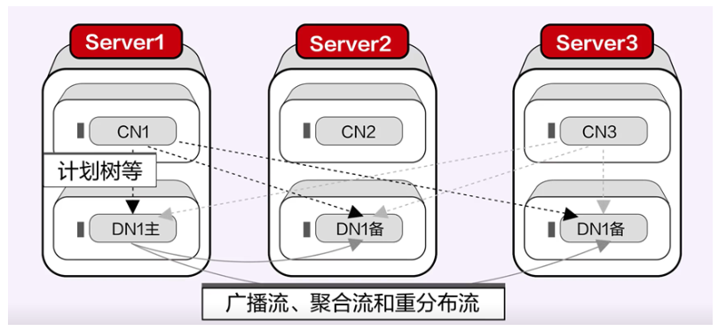

- **数据分片与分布**GaussDB采用非共享分布式架构，通过将业务数据分散到多个节点上，实现大规模数据的并行处理。每个节点拥有独立的CPU、内存和存储资源，数据分析任务可以在数据所在节点附近执行，从而提高数据处理效率。
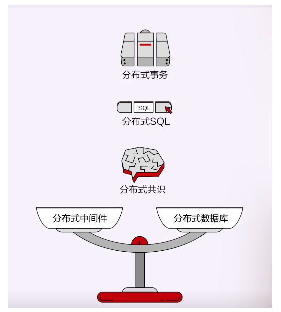

- **分布式一致性协议**
GaussDB使用多版本并发控制机制（MVCC）和全局事务管理（GTM），确保分布式系统中的数据一致性。事务控制信息由GTM管理，以支持分布式环境下的高效事务处理。

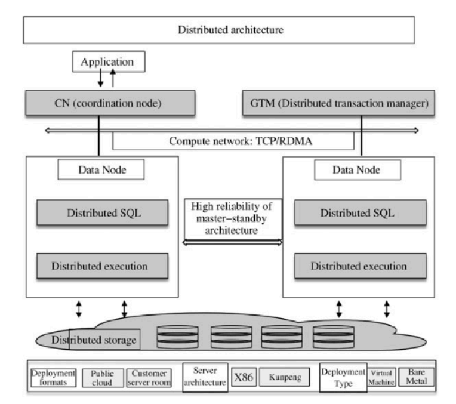

### 4.2 高可用性

- **复制机制**GaussDB通过多节点集群实现高可用性 ，主节点和多个只读节点共享底层存储，实现读写分离。跨可用区部署提高了系统的可靠性，确保在单点故障情况下业务不中断。
- **故障恢复**
GaussDB支持自动备份和快照功能，集群快照可以定期备份至外部存储，确保在出现异常时能够快速恢复数据。集群管理器（CM）负责监控和管理分布式系统中的各个功能单元和物理资源，确保系统稳定运行。
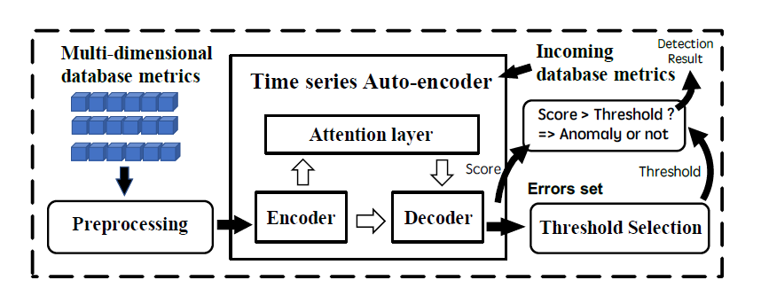

### 4.3 安全性

- **访问控制**GaussDB提供细粒度的访问控制机制，通过用户权限管理和角色分配，确保数据访问的安全性。支持SQL标准的权限控制，保障数据库资源的安全使用。[^5]
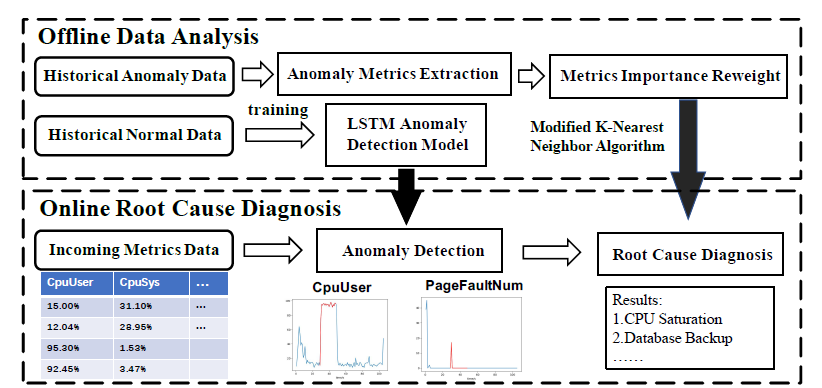
- **数据加密**数据在传输和存储过程中均采用加密技术，确保数据在各种存储介质和网络传输过程中的安全性。GaussDB支持多种加密算法和协议，满足不同行业的安全合规要求。
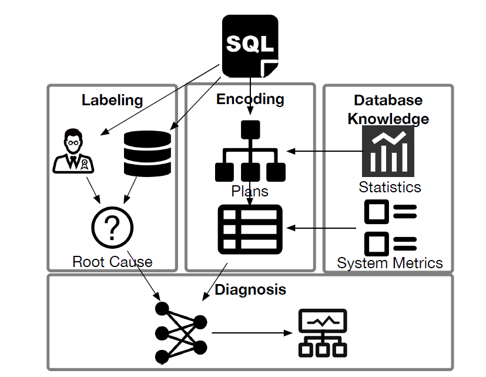
- **审计机制**
GaussDB内置审计机制，可以记录用户操作和系统事件，提供详细的操作日志和安全审计报告。审计功能帮助管理员及时发现和应对潜在的安全威胁，保障系统的安全运行。

## 5. 性能优化

### 5.1 缓存管理

- **缓存策略**
GaussDB采用多层次缓存策略，包括共享缓冲池、LRU（Least Recently Used）缓存、以及基于热点数据的自适应缓存策略。通过动态调整缓存分配，提高缓存命中率，从而加速数据访问速度。[^6]
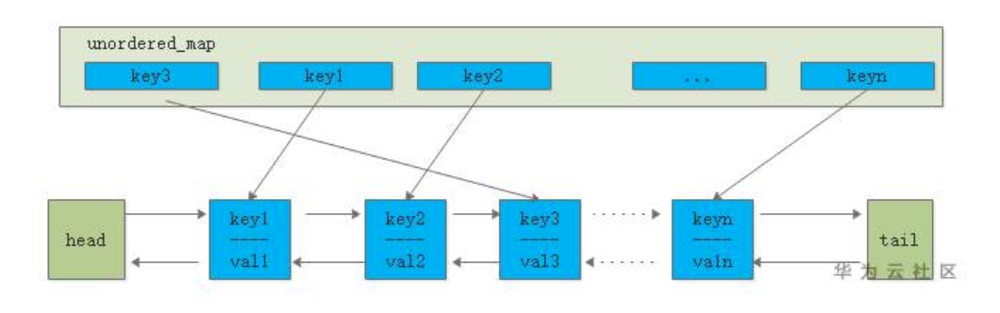

- **缓存命中率优化**
优化缓存命中率的方法包括增加缓存大小、调整缓存替换策略以及优化查询以减少不必要的数据访问。利用缓存监控工具可以实时分析缓存使用情况，识别并解决缓存命中率低的问题。

### 5.2 并发控制

openGauss并发控制是十分高效的，其核心是MVCC和快照机制。通过使用MVCC和快照，可以有效解决读写冲突，使得并发的读事务和写事务工作在同一条元组的不同版本上，彼此不会相互阻塞。对于并发的两个写事务，openGauss通过事务级别的锁机制（事务执行过程中持锁，事务提交时释放），来保证写事务的一致性和隔离性。

- **锁机制**
GaussDB支持多种锁机制，包括行锁、表锁和死锁检测。通过细粒度的锁定机制，提高并发访问的效率，并且防止死锁和长时间等待问题的发生。

- **事务隔离级别**
支持多种事务隔离级别（如读已提交、可重复读和可序列化），用户可以根据业务需求选择合适的隔离级别，平衡系统性能和数据一致性要求。

### 5.3 查询优化

- **索引使用**
通过分析查询频率和数据分布情况，合理创建和维护索引，提高查询执行效率。利用覆盖索引、联合索引等技术，可以进一步优化查询性能。

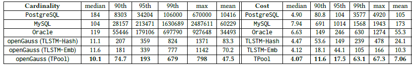

- **查询重写**
GaussDB的查询重写模块可以对输入的SQL语句进行改写，简化查询逻辑，减少不必要的计算开销。例如，将子查询转换为联接查询，或者消除冗余条件。

- **执行计划优化**
查询优化器根据统计信息和代价模型，生成高效的执行计划。通过分析和调整执行计划，可以发现并优化慢查询，提升系统整体性能。

## 6. 实践案例

### 6.1 部署与运维

- **部署步骤**
GaussDB的部署过程包括环境准备、软、、件安装、集群配置和初始化等步骤。详细的部署手册和自动化脚本可以帮助运维人员快速完成系统部署，减少人为错误。

- **运维工具与技巧**
提供丰富的运维工具，如监控平台、日志分析工具和自动化运维脚本。这些工具可以帮助运维人员实时监控系统状态，快速定位和解决问题，确保系统稳定运行。

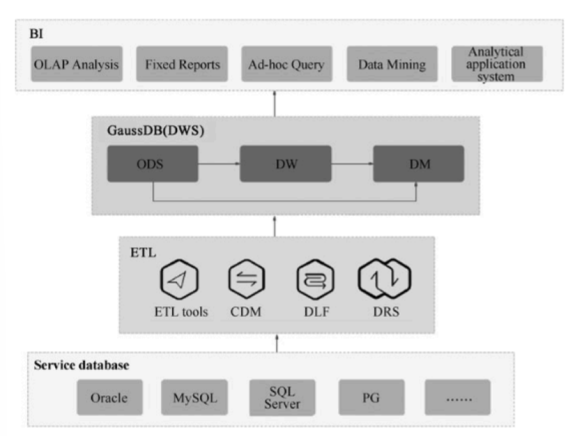

- **迁移**
GaussDB支持多种数据迁移方式，包括全量迁移、增量迁移和数据同步等。通过灵活的迁移工具，可以实现数据的无损迁移，确保数据安全性和业务连续性。

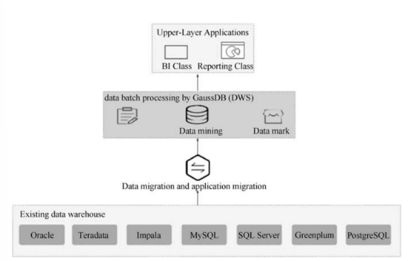

### 6.2 性能调优实例

- **常见性能问题及解决方案**
在实际使用中，常见的性能问题包括慢查询、锁等待、磁盘I/O瓶颈等。针对这些问题，常用的解决方案包括优化查询语句、调整锁策略、增加缓存和扩展存储资源等。

<table>
  <tr>
    <th>规格</th>
    <th>vCPU/电脑</th>
    <th>内存/GB</th>
  </tr>
  <tr>
    <td rowspan="4">通用增强型</td>
    <td>16</td>
    <td>64</td>
  </tr>
  <tr>
    <td>32</td>
    <td>128</td>
  </tr>
  <tr>
    <td>60</td>
    <td>256</td>
  </tr>
  <tr></tr>
  <tr>
    <td rowspan="4">鲲鹏通用增强型</td>
    <td>16</td>
    <td>64</td>
  </tr>
  <tr>
    <td>32</td>
    <td>128</td>
  </tr>
  <tr>
    <td>48</td>
    <td>192</td>
  </tr>
  <tr></tr>
</table>

- **调优实例分析**
通过具体的性能调优实例分析，展示如何识别性能瓶颈并采取有效的调优措施。例如，通过查询日志分析定位慢查询，调整索引和执行计划，显著提升查询性能。

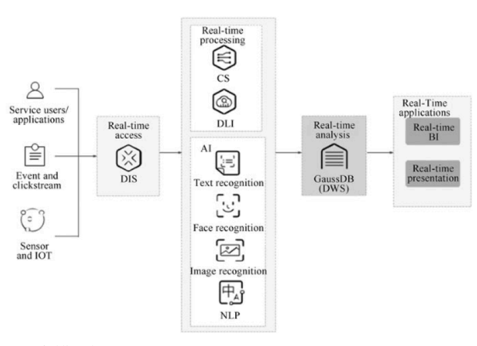

## 7. 未来展望

### 7.1 新技术趋势

- **人工智能与机器学习在数据库中的应用**
随着人工智能和机器学习技术的迅猛发展，这些技术逐渐被应用到数据库系统中，以提升数据库的智能化水平。例如，机器学习可以用于数据库的自动调优、自我修复和智能查询优化，显著提高系统性能和管理效率。未来，GaussDB将继续深度融合AI技术，进一步增强其自动化管理能力和智能化运维水平。

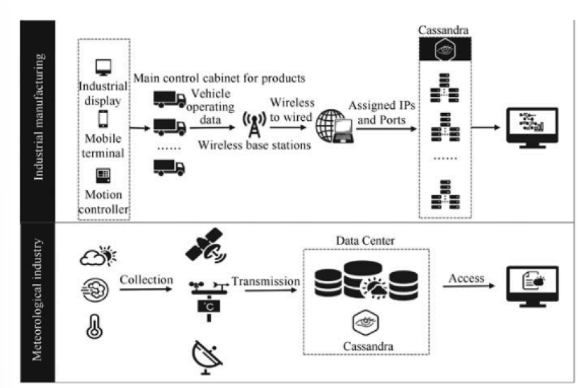

- **新硬件技术对数据库的影响**
新型硬件技术的发展，如非易失性存储器（NVM）、高性能计算（HPC）和可编程硬件（如FPGA），正在改变数据库系统的设计和实现方式。GaussDB将充分利用这些新硬件技术，提升数据处理速度和系统扩展能力。通过优化硬件与软件的协同工作，GaussDB能够在性能和可靠性方面取得更大的突破。

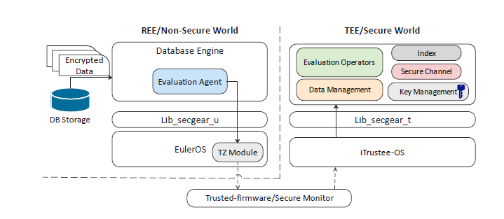

### 7.2 GaussDB的发展方向

未来，GaussDB的发展方向将围绕以下几个方面展开：

- **进一步提升性能和扩展性**
不断优化存储和计算架构，以适应更大规模的数据处理需求和更高的系统吞吐量。

- **增强智能化管理能力**
深度融合人工智能技术，提升系统的自我调优、自我修复和自动化运维能力，减少人为干预和运维成本。

- **加强安全性和合规性**
针对不断变化的安全威胁和合规要求，GaussDB将继续强化数据保护措施和审计功能，确保用户数据的安全和隐私。

- **拓展应用场景**
持续拓展GaussDB在不同领域和行业的应用，如金融、医疗、制造等，满足各行业对数据管理和分析的多样化需求。

## 8. 总结

- **主要发现**
本文通过对GaussDB的内核架构、关键技术和性能优化等方面的详细分析，展示了GaussDB作为一款先进数据库系统的独特优势和创新点。GaussDB在分布式架构、高可用性、安全性和性能优化等方面表现出色，具备良好的扩展性和智能化管理能力。

- **未来工作**
在未来的研究和实践中，将继续关注新技术的发展对数据库系统的影响，探索更多的优化方法和应用场景。特别是结合人工智能和新型硬件技术，进一步提升数据库系统的智能化水平和性能表现。同时，持续改进GaussDB的安全性和合规性，确保其在各行业中的广泛应用和可靠性。

----------
## 参考文献
[^1]: Jinwei Zhu, Kun Cheng, Jiayang Liu, and Liang Guo. "Full Encryption: An end-to-end encryption mechanism in GaussDB." *Proceedings of the VLDB Endowment*, vol. 14, no. 12, 2021, pp. 2811–2814. DOI: 10.14778/3476311.3476351
[^2]: Feng Sheng, Ying Wang, and Chun Liu. 2023. Design and Implementation of FY Satellite Remote Sensing Image Storage System Based on GaussDB for Mongo. In *Proceedings of the 5th International Conference on Information Technologies and Electrical Engineering (ICITEE '22)*, Association for Computing Machinery, New York, NY, USA, 694–698. https://doi.org/10.1145/3582935.3583051
[^3]: Guoliang Li, Xuanhe Zhou, Ji Sun, Xiang Yu, Yue Han, Lianyuan Jin, Wenbo Li, Tianqing Wang, and Shifu Li. 2021. OpenGauss: an autonomous database system. Proc. VLDB Endow. 14, 12 (July 2021), 3028–3042. https://doi.org/10.14778/3476311.3476380
[^4]: Li G, Zhou X, Sun J, et al. opengauss: An autonomous database system[J]. Proceedings of the VLDB Endowment, 2021, 14(12): 3028-3042.
[^5]: Li L, Zhang X, Pu F, et al. GaussTS: Towards Time Series Data Management in OpenGauss[C]//Asia-Pacific Web (APWeb) and Web-Age Information Management (WAIM) Joint International Conference on Web and Big Data. Singapore: Springer Nature Singapore, 2023: 496-501.
[^6]: Grosman R, Wu Y. GaussDB Evolution and Research Directions[J]. Ontario DataBase Day–Program, 2023: 11.